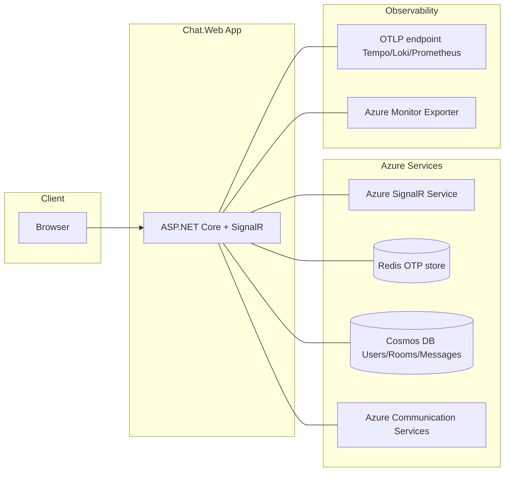
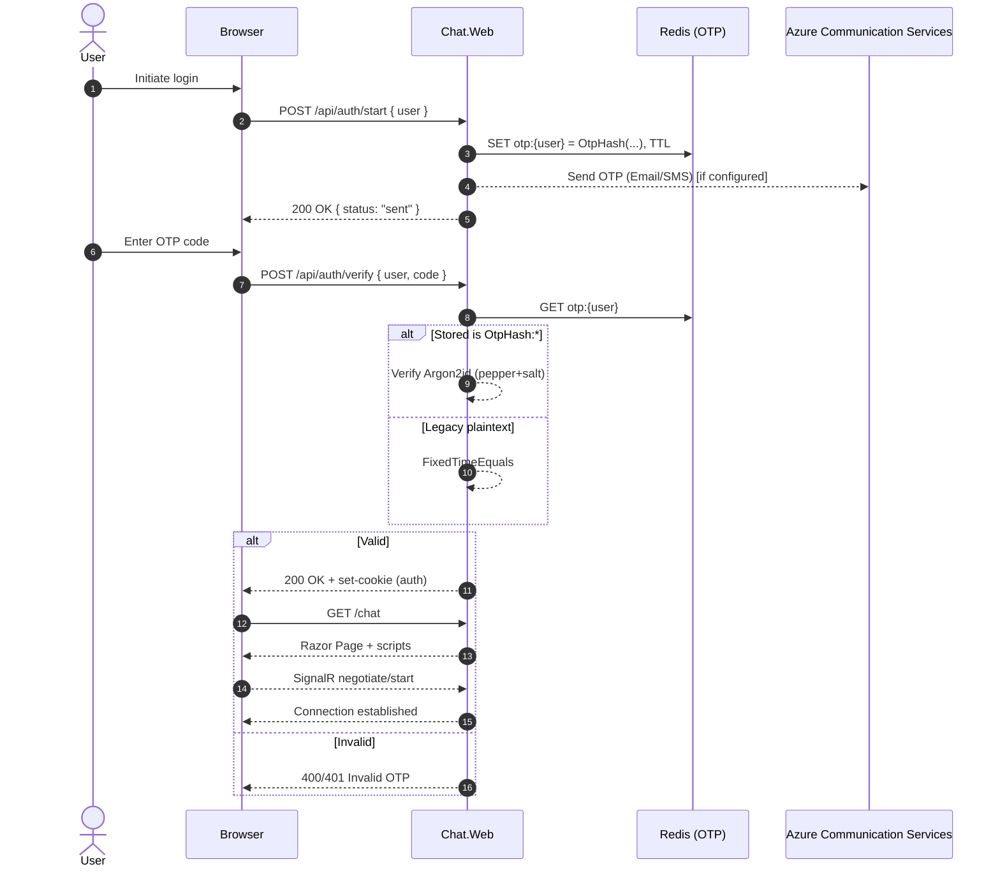
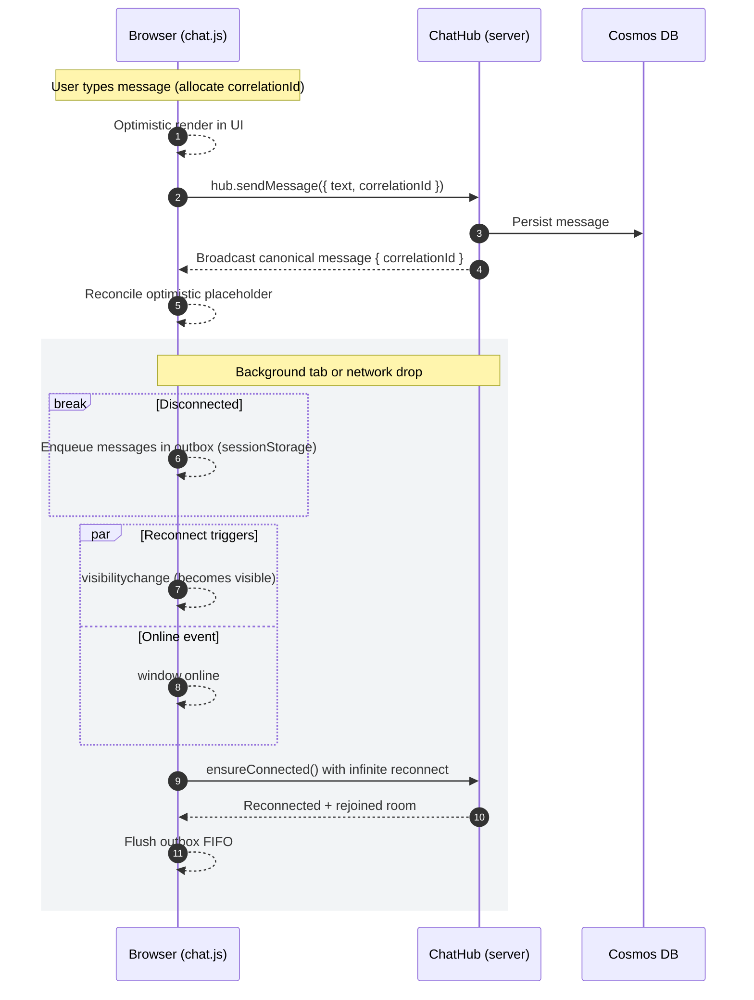
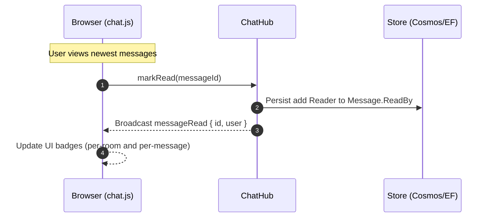

# Architecture

This document describes the high-level architecture of SignalR-Chat with focus on the OTP hashing implementation.

## Diagrams

The following Mermaid diagrams visualize the system components and key runtime flows.

### System architecture



Notes:
- Azure SignalR is used in non-test modes; in Testing:InMemory the app uses in-process SignalR only.
- Redis is used exclusively for OTP storage; messages/users/rooms are stored in Cosmos DB via repositories.
- Observability exporters are selected by configuration: Azure Monitor > OTLP > Console.

### OTP authentication flow



### Messaging, optimistic UI, and reconnect



### Read receipts flow



## Runtime overview
- ASP.NET Core 9 (Razor Pages + Controllers + SignalR Hub)
- Persistence: EF Core; Cosmos DB repositories in normal mode, in-memory repositories in Testing:InMemory mode
- OTP store: Redis in normal mode, in-memory in Testing:InMemory
- Auth: Cookie authentication after OTP verification (dedicated `/login` page)
- Observability: OpenTelemetry (traces, metrics, logs) with exporter auto-selection
 - SignalR transport: In-process by default; Azure SignalR is automatically added when not in Testing:InMemory mode

## OTP authentication and hashing

### Goals
- Avoid storing OTP codes in plaintext while preserving a simple UX.
- Support a migration path from legacy plaintext values without breaking existing sessions.
- Keep implementation configurable and versioned for future upgrades.

### Components
- `IOtpHasher` (src/Chat.Web/Services/IOtpHasher.cs)
  - Contract: `string Hash(string userName, string code)` and `VerificationResult Verify(string userName, string code, string stored)`
  - `VerificationResult` has `IsMatch` and `NeedsRehash` flags.
- `Argon2OtpHasher` (src/Chat.Web/Services/Argon2OtpHasher.cs)
  - Uses Isopoh.Cryptography.Argon2 (managed .NET implementation)
  - Algorithm: Argon2id (HybridAddressing in Isopoh enum)
  - Per-code random 16-byte salt
  - Preimage: `pepper || userName || ':' || salt || ':' || code`
  - Stores a versioned record with explicit KDF parameters:
    - Format: `OtpHash:v2:argon2id:m={KB},t={it},p={par}:{saltB64}:{encoded}`
    - `encoded` is the library’s PHC-style encoded string for the computed hash
  - Verification: recomputes the same preimage using the stored salt and calls `Argon2.Verify(encoded, preimage, threads)`
  - `NeedsRehash` is true when configured parameters are stronger than those embedded in the stored record
- `OtpOptions` (src/Chat.Web/Options/OtpOptions.cs)
  - `Pepper` (Base64 string) – load from environment variable `Otp__Pepper`
  - `HashingEnabled` (default true)
  - Argon2 parameters: `MemoryKB`, `Iterations`, `Parallelism`, `OutputLength`

### DI and configuration
- Registered in `Startup.ConfigureServices`:
  - `services.Configure<OtpOptions>(Configuration.GetSection("Otp"));`
  - `services.PostConfigure<OtpOptions>(...)` reads `Otp__Pepper` from environment when present
  - `services.AddSingleton<IOtpHasher, Argon2OtpHasher>();`
- OTP store selection:
  - Testing:InMemory=true → `InMemoryOtpStore`
  - Otherwise → Redis via `IConnectionMultiplexer` and `RedisOtpStore`
- Sender selection:
  - If ACS configured → `AcsOtpSender`
  - Else → `ConsoleOtpSender` (writes OTP to console for local development)

### Controller behavior
- `AuthController`:
  - Start
    - Reuses unexpired plaintext OTP only for legacy values (non-hashed); otherwise generates a new code
    - Stores `OtpHash:...` when `HashingEnabled=true`, else plaintext (testing/legacy)
    - Sends the OTP using primary channel (email or phone) with console fallback
  - Verify
    - Reads stored value; if begins with `OtpHash:` → use `IOtpHasher.Verify`
    - Else (legacy plaintext) → constant-time comparison via `CryptographicOperations.FixedTimeEquals`
    - On success: deletes the OTP entry and issues a cookie auth ticket
    - Redirects: Accepts an optional `ReturnUrl` but validates it server-side with `Url.IsLocalUrl`. The API responds with `{ nextUrl: "/chat" | <safe local path> }`. The client navigates to this `nextUrl`.

### Login page behavior
- `GET /login`: If already authenticated and a `ReturnUrl` query param is present, the server validates it with `Url.IsLocalUrl` and performs `LocalRedirect` to a safe path (default `/chat`).
- Client script exposes a sanitized `window.__returnUrl` for UX purposes, but the server remains the source of truth.

### Security considerations
- OTP hashing: Pepper is required for meaningful hashing; use a high-entropy Base64 value (>= 32 bytes) per environment. Keep `HashingEnabled=true` in all non-test environments. The stored format is versioned to allow future upgrades without breaking verification.
- Redirect validation: All redirect targets are validated server-side using `Url.IsLocalUrl`. The client uses server-issued `nextUrl` values for navigation after verification.
- DOM XSS hardening: UI rendering avoids `innerHTML` when dealing with user-derived content; code uses `textContent` and element creation.
- Rate limiting: OTP endpoints are protected by a fixed-window rate limiter (configurable).
- Log forging mitigation: `RequestTracingMiddleware` sanitizes request method and path before logging.

## Observability
- Domain counters (Meter `Chat.Web`): `chat.otp.requests`, `chat.otp.verifications`, plus chat-centric metrics.
- OpenTelemetry exporters are chosen in priority order: Azure Monitor (Production) → OTLP → Console. Serilog OTLP sink is enabled only when `OTel__OtlpEndpoint` is present; otherwise logs remain on console.

## Cosmos messages retention (TTL)
When Cosmos DB repositories are used, the messages container's `DefaultTimeToLive` is managed at startup to match configuration:

- Option: `Cosmos:MessagesTtlSeconds` (nullable integer)
  - `null` or unset/empty → TTL disabled (container DefaultTimeToLive cleared)
  - `-1` → TTL enabled but items never expire by default (Cosmos semantics)
  - `> 0` seconds → items expire after the configured lifetime
- Reconciliation: The application reads the current container properties and updates `DefaultTimeToLive` when it differs from the configured value, including clearing it when disabled. This ensures drift correction when config changes between deployments.
# Architecture

This section captures core components and runtime flows beyond OTP specifics.

## Current Overview
- **Framework**: ASP.NET Core (Razor Pages + minimal MVC endpoints + SignalR Hub)
- **Real-time Transport**: SignalR (in-process hub).
- **Persistence**: Entity Framework Core (ApplicationDbContext) with underlying relational store (migrations indicate relational usage).
- **Authentication**: Passwordless one-time passcode (OTP) flow. Short-lived OTP codes stored in Redis; successful verification establishes cookie-auth session.
- **Redis Usage**: Only for OTP storage (key prefix `otp:`) with TTL; no chat message caching or SignalR backplane configured yet.
- **Front-End**: Vanilla JavaScript modules (`chat.js`, `site.js`, `login.js`) referenced directly by Razor pages. Optional esbuild step can produce minified bundles in `wwwroot/js/dist/` for production testing.
- **Messaging Model**: All chat messages are sent exclusively through the SignalR hub (`ChatHub`).
- **Removed Feature**: Private/direct messaging (`/private(user)`) removed; only room-based broadcast remains.
- **Client Reliability**: Outbox queue with sessionStorage persistence for messages typed while disconnected or during (re)join. Queue flushes automatically after join / reconnect.
- **Optimistic UI**: Messages render immediately with temporary local metadata and reconcile on authoritative broadcast via correlation ID.
- **Background Connection Behavior**: Infinite reconnect policy with exponential backoff, extended server timeout (~240s) and keep-alives (~20s) to tolerate background tab throttling; proactive ensureConnected on `visibilitychange` and `online` events.
- **Attention UX**: When a new message arrives and the tab is hidden, the document title blinks until the tab is visible again.
- **Telemetry / Observability**: Activity/trace correlation through custom fetch wrapper capturing `X-Trace-Id`; client emits structured telemetry events (join attempts, sends, queue flush metrics); server leverages `ActivitySource` spans in hub operations.

## Key Components
| Layer | Component | Responsibility |
|-------|-----------|----------------|
| Client | `chat.js` | Connection lifecycle (connect/join/reconnect), outbox queue, optimistic sends, reconciling broadcasts, telemetry emission. |
| Client | Read receipts UI | Debounced mark-as-read when timeline bottom is reached; updates per-message ReadBy badges. |
| Client | `site.js` | General UI behaviors (sidebar toggles, OTP modal workflow, tooltips, message actions UI). |
| Real-time | `ChatHub` | Single entry-point for sending messages and joining rooms. Normalizes routing, enriches tracing, broadcasts canonical message DTOs. |
| Background | `UnreadNotificationScheduler` | Schedules per-message delayed unread checks; sends notifications to recipients excluding sender/readers. |
| Services | `NotificationSender` / `AcsOtpSender` | Formats notification payloads and delivers them via email/SMS; enforces notification subject/body contract while preserving OTP formatting. |
| Auth | Auth Controllers / OTP API | `start` (generate/store OTP in Redis), `verify` (validate OTP, issue auth cookie), `logout`. |
| Data | `ApplicationDbContext` & EF migrations | Stores Users, Rooms, Messages. |
| OTP Store | `RedisOtpStore` | Wrapper over StackExchange.Redis for code set/get/delete with TTL. |
| Config | `RedisOptions` | Connection string, DB index, OTP TTL seconds. |
| Build | esbuild tasks (VS Code tasks.json) | Produce minified bundles consumed by layout. |

## SignalR Role
SignalR provides the real-time bi-directional communication channel between browser clients and the server, handling:
- Hub method invocation (client → server: send/join operations)
- Broadcast fan-out scoped to room groups
- Connection lifecycle events used to trigger auto-join and queued message flush
- Basic ordering within a single hub instance (optimistic reconciliation on client covers timing gaps)

Azure SignalR is used when not running in Testing:InMemory mode; otherwise in-process SignalR is used. No Redis backplane is configured; multi-instance scale-out could use Redis backplane as an alternative.

## Redis Role
Redis is presently limited to OTP storage:
- Key pattern: `otp:{userName}`
- Value: versioned Argon2id hash by default (format `OtpHash:v2:argon2id:...`) with TTL `RedisOptions.OtpTtlSeconds` (default 300s); plaintext is supported only when `Otp:HashingEnabled=false` for testing/legacy
- Operations: set, get, remove invoked through `RedisOtpStore` with retry + cooldown guards for transient errors

Potential future roles: SignalR backplane, presence cache, rate limiting, hot message cache.

## Runtime Flows
### OTP Authentication
1. Client POSTs `/api/auth/start` (generate + store OTP in Redis)
2. User receives/displayed code out-of-band via ACS (email/SMS) when configured; otherwise written to console for local development
3. Client POSTs `/api/auth/verify` with code
4. Server validates, issues auth cookie
5. Client opens SignalR connection and auto-joins a room; outbox flush begins

### Auto-Join & Queue Flush
- Determine target room (user default, only room, or first) then invoke hub join
- Drain sessionStorage queue FIFO, sending each with preserved correlationId

### Optimistic Send
1. User action → allocate correlationId + temporary placeholder
2. If connected: send through hub; if not: enqueue
3. Hub persists and broadcasts canonical message (includes correlationId)
4. Client reconciles & finalizes

### Reconnect Handling
- Messages composed offline accumulate in queue
- On reconnection + join success, queued messages flush automatically
- Proactive reconnect is attempted on `visibilitychange` (when becoming visible) and `online` events

### Unread notification scheduling
1. On message send, the server schedules a delayed check for that message using `UnreadNotificationScheduler`.
2. After `Notifications:UnreadDelaySeconds` (default 60), the scheduler queries the message state.
3. If the message is still unread by all recipients, it computes recipients:
  - Primary: `room.users` when present
  - Fallback: users whose `fixedRooms` contains the room name
  - Excludes: the sender and any users in `message.readBy`
4. `NotificationSender` sends one notification per recipient through the configured channels.

Formatting contract:
- Email subject: `New message`
- Email body: `New message in #<room>`
- SMS body: `New message in #<room>`
- No message text is included to avoid leaking content through notifications.

## Build & Front-End Delivery
- Source JS under `wwwroot/js/` is used directly in development and referenced by pages. Optional build tasks can create minified bundles in `wwwroot/js/dist/` for production testing; pages do not reference `dist` by default.

## Observability & Telemetry
- Server Activities wrap hub operations; `X-Trace-Id` header surfaces trace id to client
- Client logs join attempts, send outcomes, queue flush metrics; correlates with trace id

## Scaling Considerations
| Concern | Current State | Scale-out Path |
|---------|---------------|----------------|
| Real-time fan-out | Single hub instance | Add Redis backplane or Azure SignalR Service |
| Message persistence | Single EF DB | Shard or move to partitioned store |
| OTP store | Single Redis | Managed/clustered Redis |
| Outbox durability | sessionStorage | IndexedDB or server-side queue |
| Presence tracking | Not implemented | Redis sets / ephemeral keys |

## Security Notes
- OTP codes are stored hashed by default (Argon2id + salt + pepper). Legacy/plaintext verification is supported only when explicitly enabled for testing and uses constant-time comparison. Provide a high-entropy Base64 pepper per environment via `Otp__Pepper`.
- Correlation IDs are opaque UUIDs (avoid embedding user data)
- OTP endpoints are rate-limited.

## Future Roadmap (Prioritized)
1. Presence & typing indicators
2. Backplane scale-out metrics & multi-instance benchmarks
3. Enhanced pagination UX/accessibility
4. Additional OTP anti-abuse policies (per-user/IP counters in Redis)

## Glossary
- **CorrelationId**: UUID bridging optimistic send and server broadcast
- **Outbox Queue**: Client sessionStorage FIFO of unsent messages
- **OTP**: Short-lived passcode enabling passwordless login
- **Hub**: SignalR abstraction for connections, groups, messaging

## Data schemas

This section documents the canonical shapes for the three core entities used by the application: user, room, and message.

Notes on storage:
- The domain models are defined via EF Core entities, but the app can also use Cosmos-backed repositories. Shapes below capture the semantic contract across both.
- Admin tooling may emit slightly different field names; compatibility rules are noted per entity.

### User

Purpose: Identity for OTP login, room authorization, and message attribution.

Canonical fields:
- id: string (stable user key; example: "alice")
- userName: string (login/display identity; often same as id)
- fullName: string | null
- avatar: string | null (URL or slug; optional)
- enabled: boolean (default true) — determines if the user is allowed to sign in
- email: string | null
- mobileNumber: string | null (E.164 recommended)
- fixedRooms: string[] (room names the user may join; enforced server-side)
- defaultRoom: string | null (preferred room to auto-join; derived when not provided)

Relationships (relational model):
- Messages (one-to-many via Message.FromUser)
- Rooms (navigation-only convenience; joining is governed by FixedRooms, not a join table)

Cosmos compatibility:
- Some documents may store `rooms` instead of `fixedRooms`. The repository accepts either; when both present, `fixedRooms` wins.
- If `defaultRoom` is missing, the app derives it: if there is exactly one allowed room → that one; otherwise the first name in alphabetical order.

Example (logical JSON shape):
```
{
  "id": "alice",
  "userName": "alice",
  "fullName": "Alice A.",
  "avatar": null,
  "enabled": true,
  "email": "alice@example.com",
  "mobileNumber": "+12065551234",
  "fixedRooms": ["general", "ops"],
  "defaultRoom": "general"
}
```

### Room

Purpose: Public channel for posting messages.

Canonical fields:
- id: integer (stable numeric id)
- name: string (room key and display name; examples: "general", "ops", "random")
 - users: string[] (optional helper; list of user names present in the room document)

Relationships:
- Messages (one-to-many via Message.ToRoomId)

Cosmos compatibility:
- Some documents may have a non-numeric `id` (string). The repository computes a stable numeric id for in-app use (deterministic hash) when needed.
- Legacy/admin-authored docs might include an `admin` field; the app ignores it.
 - Some documents may include a `users` array. This is a denormalized helper maintained by external admin tooling. Chat.Web treats it as read-only and does not reconcile or mutate it at runtime. The authoritative source of room membership remains `user.fixedRooms`.

Example (logical JSON shape):
```
{
  "id": 1,
  "name": "general",
  "users": ["alice", "bob"]
}
```

### Message

Purpose: Immutable text payload attributed to a user and room, with a server timestamp.

Canonical fields:
- id: integer (surrogate key, monotonic per store)
- content: string (text body)
- timestamp: string (ISO 8601 UTC)
- fromUser: object (minimal attribution; in relational form this is a foreign key; in Cosmos a denormalized projection may appear)
  - id: string
  - userName: string
- toRoomId: integer (foreign key to Room.id)
- readBy: string[] (user names who have read the message)

Relationships:
- FromUser (many-to-one)
- ToRoom (many-to-one)

Cosmos compatibility:
- The repository persists and reads messages from a container that may include additional system fields (`_ts`, `_etag`, etc.); these are ignored by the domain model.
- TTL can be enabled on the container; deletion is managed by Cosmos based on `DefaultTimeToLive` (see the TTL section above).

Example (logical JSON shape):
```
{
  "id": 1042,
  "content": "Hello, world",
  "timestamp": "2025-10-13T12:34:56.789Z",
  "fromUser": { "id": "alice", "userName": "alice" },
  "toRoomId": 1
}
```

---
This document reflects the current architecture: Azure SignalR in non-test mode, background-stable client connection, hashed OTP storage, and OpenTelemetry-first observability.
