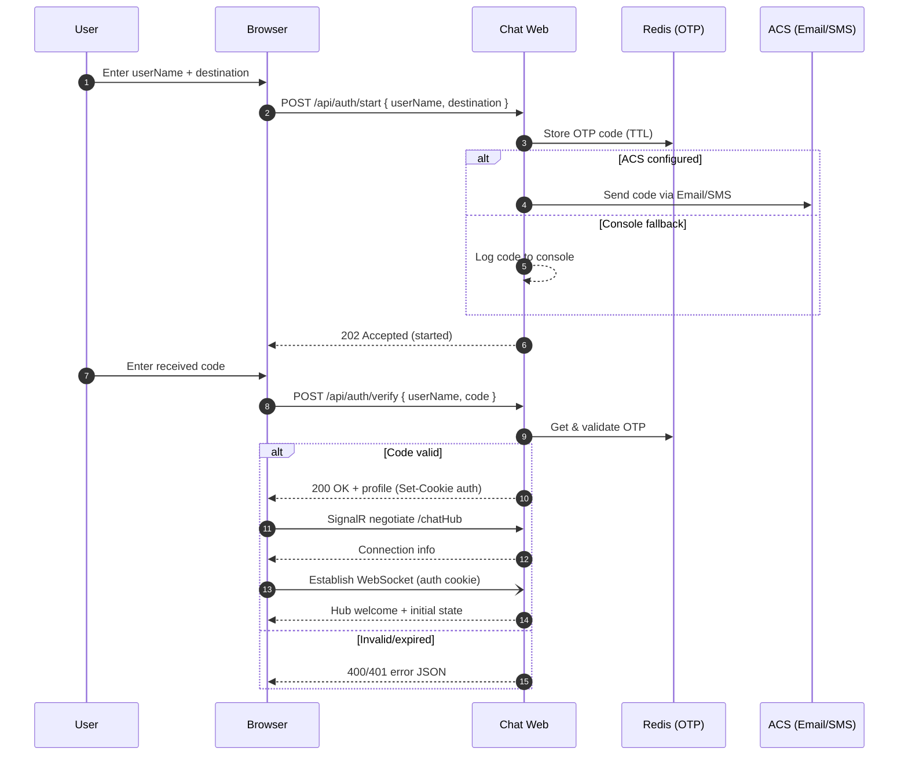
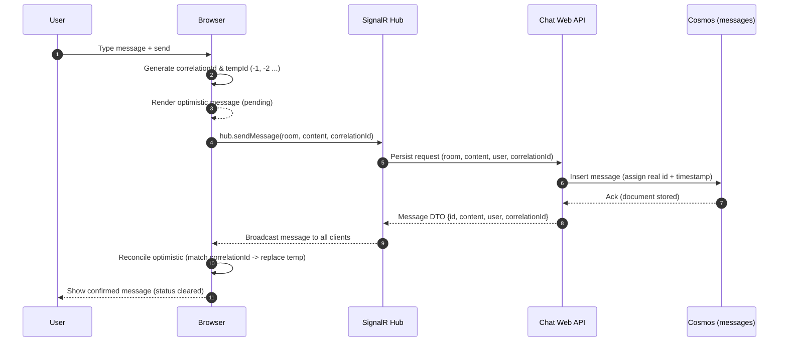

# Architecture

This document describes the high-level architecture of the SignalR-Chat application, its main components, and key runtime flows.

## Overview
- **Framework**: ASP.NET Core 9 (Razor Pages host + MVC API + SignalR Hub)
- **Real-time**: Azure SignalR Service
- **Data**: Azure Cosmos DB (containers: users, rooms, messages) partitioned for horizontal scale
- **Cache / OTP**: Redis (stores short-lived OTP codes)
- **Optional**: Azure Communication Services (Email/SMS) for OTP code delivery
- **Auth**: Cookie-based session established after OTP verification
- **Observability**: Serilog (structured logs) + OpenTelemetry Activities (console exporter) + custom request tracing middleware
- **Client**: Single vanilla JavaScript module (`wwwroot/js/chat.js`) handling state, DOM rendering, optimistic messaging, pagination, and SignalR interaction

## Component Diagram (Conceptual)
```
Browser (chat.js)
   | (HTTPS + Cookie)
   v
Chat.Web (ASP.NET Core)
   |-- Controllers (Auth, Messages, Rooms)
   |-- SignalR Hub (ChatHub)
   |-- Repositories (Cosmos*)
   |-- OTP (Redis + ACS/Console)
   |-- Observability (Serilog + OTel)

External Services:
   - Azure SignalR Service
   - Azure Cosmos DB (SQL API)
   - Azure Cache for Redis
   - Azure Communication Services (optional)
```

## Sequence: OTP Authentication Flow


## Sequence: Optimistic Message Send & Reconciliation


## Data Model Highlights
| Entity | Key | Partition Key | Notes |
|--------|-----|---------------|-------|
| User | userName | /userName | Simple profile (no password; OTP only) |
| Room | name | /name | Metadata for grouping messages |
| Message | id (GUID/assigned) | /roomName | Stored with room partition for efficient recent/older pagination |

## Pagination Strategy
1. Initial fetch: newest N messages (descending query → sorted ascending in memory)
2. Older fetch: pass `before` = oldest currently loaded message timestamp.
3. Client preprends without losing scroll position.

## Optimistic Messaging Strategy
- Client assigns temporary negative IDs + a UUID `correlationId`.
- On broadcast, matches by `correlationId`; falls back to content/negative ID if necessary.
- Removes duplicate temporary entries.

## Configuration Strategy
- `appsettings.json`: structural placeholders (no secrets)
- `appsettings.Production.json`: stricter logging
- Runtime secrets via environment variables / user secrets (`Cosmos__`, `Redis__`, `Acs__`)

## Observability
- Custom middleware starts an Activity per request; trace id returned via `X-Trace-Id` header.
- Repository calls add tags (room, counts) for diagnostics.
- Serilog request logging enriches environment + trace metadata.

## Future Enhancements
- OTLP exporter for traces / metrics
- In-memory dev fallback (optional) to run without Cosmos/Redis
- UI styling for pending optimistic messages (visual difference)
- Additional integration tests (pagination edge cases, reconnection)

---
This document will evolve alongside architectural changes.
