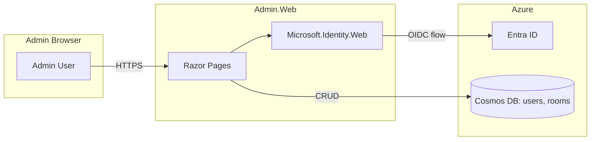

## Admin.Web Architecture

This branch focuses on the Admin.Web application — a minimal, secure admin panel using Microsoft Entra ID for authentication and Cosmos DB for data.

### Components
- ASP.NET Core 9 (Razor Pages)
- Authentication: Microsoft.Identity.Web (OpenID Connect)
- Data: Cosmos DB (Containers: users, rooms)
- UI: Server-rendered Razor Pages with lightweight CSS

### High-level diagram

```mermaid
flowchart LR
  subgraph Admin Browser
    B[Admin User]
  end
  subgraph App[Admin.Web]
    RZ[Razor Pages]
    OIDC[Microsoft.Identity.Web]
  end
  subgraph Azure
    AAD[Entra ID]
    C[(Cosmos DB: users, rooms)]
  end

  B -->|HTTPS| RZ
  RZ --> OIDC
  OIDC -->|OIDC flow| AAD
  RZ -->|CRUD| C
```

### Request flow
1. Unauthenticated request → redirected to Entra ID (OIDC sign-in)
2. After sign-in, Entra issues tokens; middleware signs in the user
3. Authorized user accesses Razor Pages:
  - Users: list, create, toggle enabled, assign rooms
   - Rooms: list, create
4. Repositories read/write documents in Cosmos containers

### Data model (simplified)
- User document
  - id/userName, email, mobile
  - enabled (bool)
  - rooms: string[]
- Room document
  - id (guid), name

### Security
- All pages require authentication (fallback policy = default policy)
- Sign-out via `/MicrosoftIdentity/Account/SignOut`
- Entra ID settings:
  - Redirect URI: `https://localhost:5199/signin-oidc`
  - Front-channel logout URL: `https://localhost:5199/signout-oidc`
- No chat endpoints or SignalR in this app

### Deployment
- Deploy Admin.Web to Azure App Service with appropriate Entra ID registration and Cosmos configuration

### Health
- Anonymous health probe at `/healthz` returns `ok`

