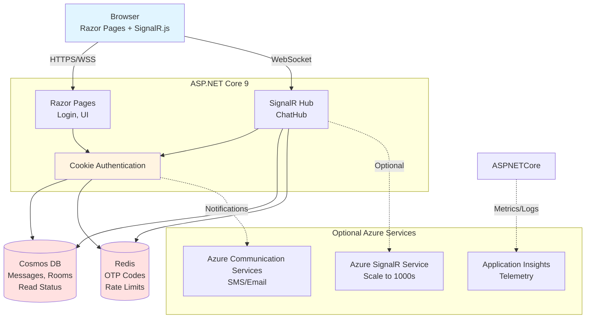

# SignalR Chat (v0.9.5)

A production-ready real-time chat application built with ASP.NET Core 9, SignalR, Azure Cosmos DB, and Redis. Features fixed chat rooms, OTP authentication, read receipts, presence tracking, and comprehensive observability.

> **Status**: Production-ready | **License**: [MIT](LICENSE) | **Tests**: 124 passing ✅


<!-- TODO: Add screenshot showing login, rooms, read receipts, reconnection -->

## Why This Project?

SignalR Chat demonstrates modern real-time web application patterns with production-grade security, scalability, and observability. Built for learning and as a foundation for real-time features.

**What it does**:
- 🚀 Real-time messaging with SignalR (WebSocket + Server-Sent Events fallback)
- 🔐 Secure OTP authentication (Argon2id hashing, rate limiting)
- 👥 Fixed chat rooms: General, Tech, Random, Sports (no DMs)
- ✓ Read receipts, typing indicators, presence tracking
- 🌍 9 languages supported (i18n with server-side + client-side resources)
- 📊 Full observability (OpenTelemetry, Azure App Insights, health checks)
- 🔒 Security headers (CSP with nonces, HSTS, frame protection)

**What it doesn't do** (non-goals):
- ❌ No direct messages (DMs)
- ❌ No message editing/deletion
- ❌ No user registration (fixed users: alice, bob, charlie, dave, eve)
- ❌ No file uploads or rich media

---

## 🚀 5-Minute Quickstart (No Azure Required)

Run locally with in-memory storage (no external dependencies):

```bash
# Clone and build
git clone https://github.com/smereczynski/SignalR-Chat.git
cd SignalR-Chat
dotnet build ./src/Chat.sln

# Run with in-memory mode
dotnet run --project ./src/Chat.Web --urls=http://localhost:5099

# Open browser: http://localhost:5099
# Users: alice, bob, charlie, dave, eve
# OTP codes are printed to console (6-digit codes)
```

**What's running**:
- In-memory OTP storage (no Redis)
- In-memory session state (no Cosmos DB)
- Direct SignalR connections (no Azure SignalR Service)
- All features work except persistence across restarts

➡️ **Next**: [Full local setup with Azure resources](docs/getting-started/installation.md) | [Configuration guide](docs/getting-started/configuration.md)

---

## 📚 Documentation

| Category | Description | Link |
|----------|-------------|------|
| **Getting Started** | Installation, configuration, first run | [docs/getting-started/](docs/getting-started/) |
| **Architecture** | System design, diagrams, decisions | [docs/architecture/](docs/architecture/) |
| **Deployment** | Azure deployment, Bicep, CI/CD | [docs/deployment/](docs/deployment/) |
| **Features** | Authentication, presence, i18n, real-time | [docs/features/](docs/features/) |
| **Development** | Local setup, testing, debugging | [docs/development/](docs/development/) |
| **Operations** | Monitoring, diagnostics, health checks | [docs/operations/](docs/operations/) |
| **Reference** | API, configuration, telemetry | [docs/reference/](docs/reference/) |

---

## 🏗️ Architecture Overview



➡️ [Full architecture documentation](docs/architecture/overview.md)

---

## 🛠️ Tech Stack

| Layer | Technology | Purpose |
|-------|------------|---------|
| **Frontend** | Vanilla JS, Bootstrap 5, SignalR Client | UI, real-time updates |
| **Backend** | ASP.NET Core 9, SignalR | Web server, WebSocket hub |
| **Database** | Azure Cosmos DB (NoSQL) | Messages, rooms, read receipts |
| **Cache** | Redis | OTP storage, rate limiting |
| **Auth** | Cookie authentication + OTP | Secure login flow |
| **Observability** | OpenTelemetry, App Insights | Metrics, traces, logs |
| **Deployment** | Azure App Service (Linux), Bicep IaC | Infrastructure as Code |

---

## 📦 Project Structure

```
SignalR-Chat/
├── src/
│   ├── Chat.Web/              # Main ASP.NET Core application
│   │   ├── Controllers/       # REST API endpoints
│   │   ├── Hubs/             # SignalR ChatHub
│   │   ├── Pages/            # Razor Pages (login, chat UI)
│   │   ├── Services/         # OTP, presence, notifications
│   │   ├── Repositories/     # Cosmos DB data access
│   │   └── Middleware/       # Security headers, logging
│   └── Chat.sln              # Solution file
├── tests/
│   ├── Chat.Tests/           # Unit tests (93 tests)
│   ├── Chat.IntegrationTests/# Integration tests (22 tests)
│   └── Chat.Web.Tests/       # Web/security tests (9 tests)
├── infra/
│   └── bicep/                # Azure infrastructure (Bicep)
├── docs/                     # Documentation (detailed guides)
├── .github/
│   └── workflows/            # CI/CD pipelines
└── README.md                 # This file
```

---

## 🧪 Testing

**124 tests** covering unit, integration, and web security:

```bash
# Run all tests
dotnet test src/Chat.sln

# Run specific test project
dotnet test tests/Chat.Tests/
dotnet test tests/Chat.IntegrationTests/
dotnet test tests/Chat.Web.Tests/
```

**Test coverage**:
- ✅ 55 localization tests (9 languages × 6 categories)
- ✅ 13 security tests (log sanitization, CSP)
- ✅ 22 integration tests (OTP flow, rate limiting, SignalR lifecycle)
- ✅ 9 web tests (security headers, health endpoints)

➡️ [Testing guide](docs/development/testing.md)

---

## 🚀 Deployment

### Azure (Production)

Deploy to Azure using Bicep infrastructure as code:

```bash
cd infra/bicep

# Deploy to dev environment
az deployment sub create \
  --location westeurope \
  --template-file main.bicep \
  --parameters main.parameters.dev.bicepparam

# Deploy to production
az deployment sub create \
  --location westeurope \
  --template-file main.bicep \
  --parameters main.parameters.prod.bicepparam
```

**Automated CI/CD**: GitHub Actions workflows deploy on push to `main`

➡️ [Deployment guide](docs/deployment/azure.md) | [Production checklist](docs/deployment/production-checklist.md)

---

## 🔒 Security

- ✅ **OTP Authentication**: Argon2id hashing with pepper, 3 failed attempts lockout
- ✅ **CORS Protection**: Origin validation on SignalR hub, prevents CSRF attacks
- ✅ **CSP Headers**: Nonce-based Content Security Policy, prevents XSS
- ✅ **HSTS**: HTTP Strict Transport Security in production
- ✅ **Rate Limiting**: 5 OTP requests/min per user, 20/min per IP
- ✅ **Input Sanitization**: Log forgery prevention (CWE-117)
- ✅ **Private Endpoints**: VNet integration, no public database access

### CORS Configuration

The SignalR hub endpoint (`/chatHub`) enforces origin validation to prevent CSRF attacks. Configure allowed origins in `appsettings.json`:

**Development** (`appsettings.Development.json`):
```json
{
  "Cors": {
    "AllowAllOrigins": true,
    "AllowedOrigins": [
      "http://localhost:5099",
      "https://localhost:5099"
    ]
  }
}
```

**Production** (`appsettings.Production.json`):
```json
{
  "Cors": {
    "AllowAllOrigins": false,
    "AllowedOrigins": [
      "https://signalrchat-prod-plc.azurewebsites.net"
    ]
  }
}
```

**Azure App Service** (set via environment variables):
```bash
Cors__AllowedOrigins__0=https://yourdomain.com
Cors__AllowAllOrigins=false
```

> ⚠️ **Security**: `AllowAllOrigins` MUST be `false` in production. The application will throw an exception if set to `true` in non-Development environments.

➡️ [Security architecture](docs/architecture/security.md) | [Authentication guide](docs/features/authentication.md)

---

## 🌍 Localization

Supports 9 languages with both server-side (.resx) and client-side (API) translations:

**Languages**: English, Polish, Spanish, French, German, Italian, Portuguese, Japanese, Chinese

```bash
# Add new language key
# 1. Edit Resources/SharedResources.resx (English default)
# 2. Add to Resources/SharedResources.[culture].resx
# 3. Rebuild to embed resources

# Verify translations
dotnet test tests/Chat.Tests/ --filter "Category=Localization"
```

➡️ [Localization guide](docs/features/localization.md)

---

## 📊 Observability

**Metrics, Traces, Logs** via OpenTelemetry → Azure Application Insights

**Custom Metrics**:
- `chat.otp.requests` - OTP generation count
- `chat.otp.verifications` - OTP verification attempts
- `chat.messages.sent` - Messages sent per room
- `chat.connections.active` - Active SignalR connections

**Health Checks**:
- `/healthz` - Liveness probe (responds 200 OK)
- `/healthz/ready` - Readiness probe (checks Cosmos + Redis)

➡️ [Monitoring guide](docs/operations/monitoring.md) | [Diagnostics](docs/operations/diagnostics.md)

---

## 🤝 Contributing

We welcome contributions! Please read [CONTRIBUTING.md](CONTRIBUTING.md) for:
- Code of conduct
- How to set up your development environment
- Running tests and linters
- Commit message conventions
- Pull request process

**Quick start for contributors**:
1. Fork the repository
2. Create a feature branch: `git checkout -b feature/my-feature`
3. Make changes and add tests
4. Run tests: `dotnet test src/Chat.sln`
5. Commit: `git commit -m "feat: add my feature"`
6. Push and create a pull request

---

## 📝 License

This project is licensed under the MIT License - see [LICENSE](LICENSE) file for details.

---

## 🔗 Links

- **Documentation**: [docs/](docs/)
- **Issues**: [GitHub Issues](https://github.com/smereczynski/SignalR-Chat/issues)
- **Discussions**: [GitHub Discussions](https://github.com/smereczynski/SignalR-Chat/discussions)
- **Changelog**: [CHANGELOG.md](CHANGELOG.md)
- **Original README**: [README.old.md](README.old.md) (archived, detailed reference)

---

## ⭐ Key Features Breakdown

| Feature | Description | Implementation |
|---------|-------------|----------------|
| **Optimistic Send** | Messages appear instantly, confirmed async | SignalR invoke + server broadcast |
| **Read Receipts** | Per-user read status per message | Cosmos DB `ReadReceipts` container |
| **Typing Indicators** | "X is typing…" shown to room | SignalR `NotifyTyping` with debounce |
| **Presence Tracking** | Online/offline status | Redis cache with TTL + SignalR events |
| **Reconnection** | Auto-reconnect with exponential backoff | SignalR.js with custom retry policy |
| **Pagination** | Load 50 messages, scroll to load more | Cosmos DB continuation token |
| **Unread Badges** | "5 unread in Tech" notifications | Redis counter + SignalR updates |
| **Rate Limiting** | Prevent OTP spam, abuse | ASP.NET Core rate limiter |

---

<p align="center">
  Made with ❤️ using ASP.NET Core 9 & SignalR
</p>
