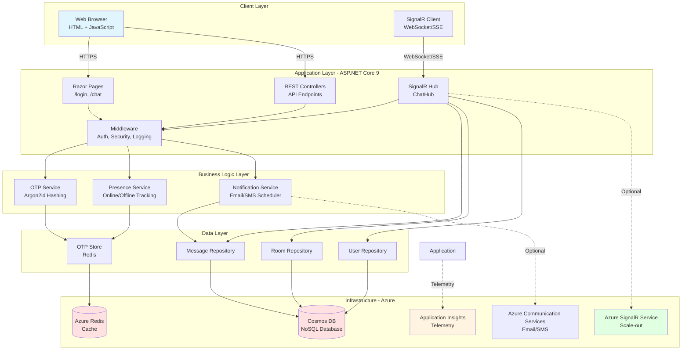
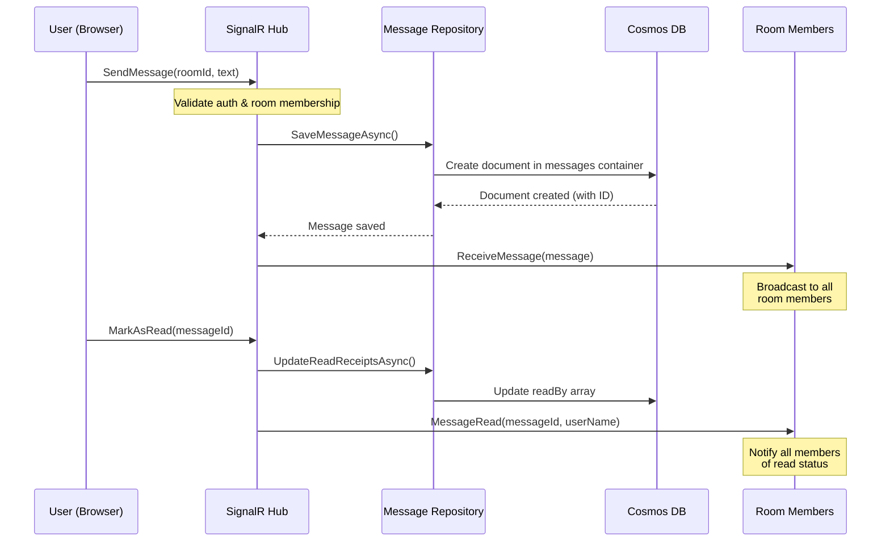
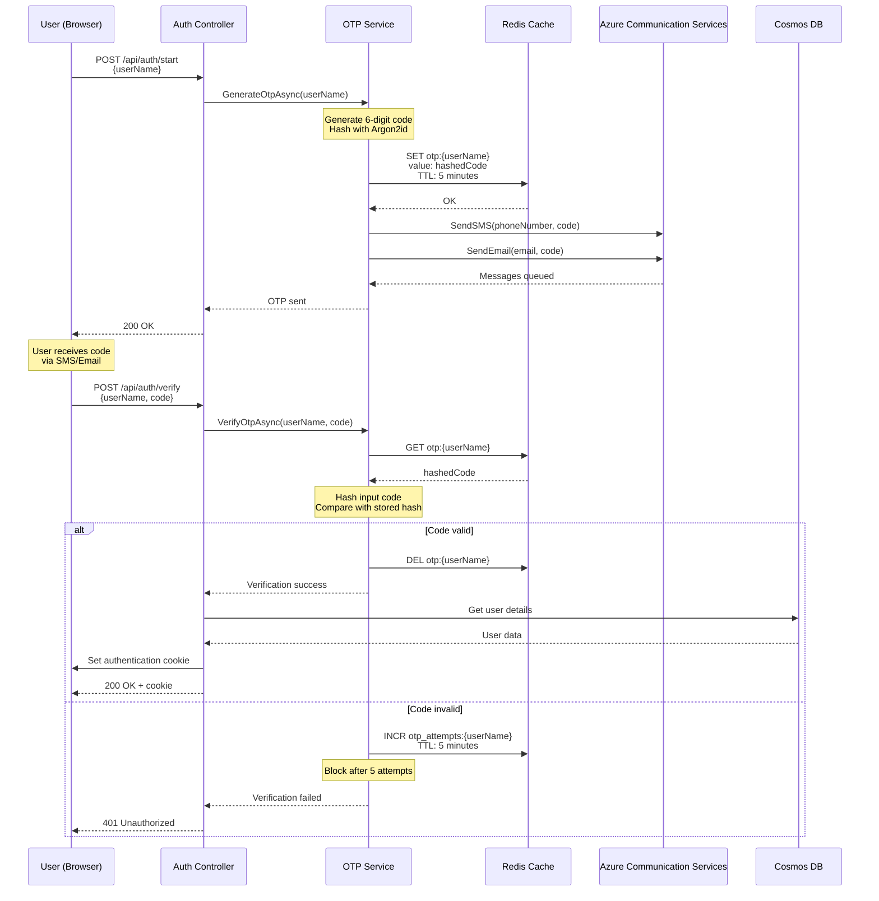
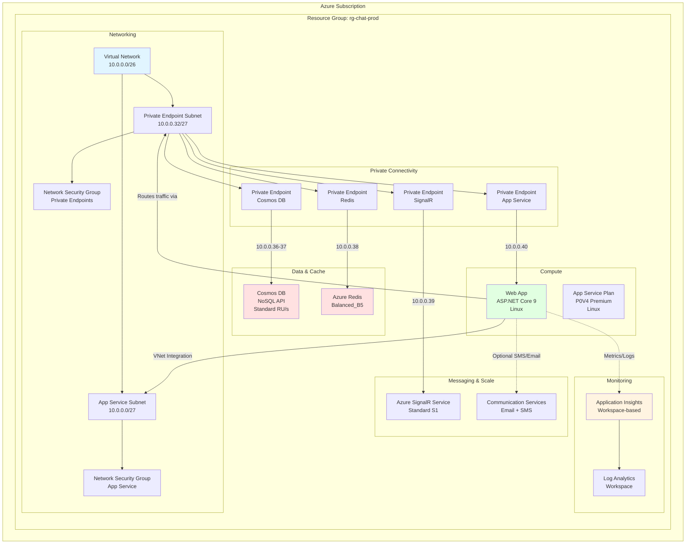
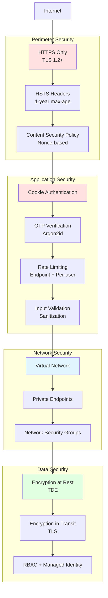

# Architecture Overview

This document provides a high-level overview of the SignalR Chat architecture, including system components, data flow, and infrastructure design.

## System Architecture

### Runtime Architecture

### Key Components

| Component | Technology | Purpose |
|-----------|-----------|---------|
| **Web Server** | ASP.NET Core 9 | HTTP server, Razor Pages, WebSocket handling |
| **Real-time Engine** | SignalR | WebSocket hub for bidirectional communication |
| **Database** | Azure Cosmos DB (NoSQL) | Messages, rooms, users, read receipts |
| **Cache** | Azure Redis | OTP storage, rate limiting, presence tracking |
| **Authentication** | Cookie-based + OTP | Secure login with Argon2id hashing |
| **Observability** | OpenTelemetry + App Insights | Metrics, traces, logs |
| **Notifications** | Azure Communication Services | Email/SMS delivery |

## Data Flow

### Message Flow

### OTP Authentication Flow

## Infrastructure Architecture

### Azure Resources

### Network Architecture

- **VNet**: /26 CIDR block (64 IPs)
- **Two subnets**:
  - App Service Integration (/27 = 32 IPs)
  - Private Endpoints (/27 = 32 IPs)
- **Private endpoints** with static IP allocation:
  - Cosmos DB: .36 (global), .37 (regional)
  - Redis: .38
  - SignalR: .39
  - App Service: .40
- **All traffic** routed through VNet (no public database access)

## Security Architecture

### Defense in Depth

### Security Measures

| Layer | Measures |
|-------|----------|
| **Transport** | HTTPS only, TLS 1.2+, HSTS with preload |
| **Headers** | CSP (nonce-based), X-Frame-Options: DENY, X-Content-Type-Options: nosniff |
| **Authentication** | Cookie-based, OTP with Argon2id hashing, 5-attempt lockout |
| **Authorization** | Room membership checks, user validation |
| **Input** | Sanitized logging (CWE-117), parameter validation |
| **Rate Limiting** | 5 OTP requests/min per user, 20 requests/5s per endpoint |
| **Network** | Private endpoints, VNet integration, NSGs |
| **Data** | Encryption at rest (Cosmos/Redis TDE), encryption in transit |

## Technology Stack

### Backend
- **Framework**: ASP.NET Core 9.0
- **Real-time**: SignalR (WebSocket + Server-Sent Events)
- **Database**: Azure Cosmos DB (NoSQL, serverless → standard provisioned)
- **Cache**: Azure Redis (Enterprise tier)
- **Authentication**: Cookie-based with OTP
- **Hashing**: Argon2id (memory: 64MB, iterations: 4)

### Frontend
- **UI**: Razor Pages with server-side rendering
- **JavaScript**: Vanilla ES6+ (no framework)
- **CSS**: Bootstrap 5.3.8
- **Real-time Client**: @microsoft/signalr 9.0.6

### Infrastructure
- **IaC**: Azure Bicep
- **CI/CD**: GitHub Actions (federated identity)
- **Monitoring**: OpenTelemetry + Azure Application Insights
- **Deployment**: Azure App Service (Linux, .NET 9)

## Scalability

### Horizontal Scaling
- **Azure SignalR Service**: Scale to 1000s of concurrent connections
- **App Service**: Multiple instances with load balancer
- **Cosmos DB**: Partitioned by roomId for even distribution
- **Redis**: Clustered for high availability

### Vertical Scaling
| Environment | App Service | Cosmos DB | Redis | SignalR |
|-------------|-------------|-----------|-------|---------|
| **Dev** | P0V4 (1 vCore) | Serverless | Balanced_B1 | Standard_S1 |
| **Staging** | P0V4 (1 vCore) | 1000 RU/s | Balanced_B3 | Standard_S1 |
| **Production** | P0V4 (1 vCore) | 4000 RU/s | Balanced_B5 | Standard_S1 |

## See Also

- [Data Model](data-model.md) - Cosmos DB schema and Redis keys
- [Security Architecture](security.md) - Detailed security design
- [Architecture Decisions (ADRs)](decisions/) - Key design decisions
- [Diagrams](diagrams/) - Additional architecture diagrams

---

**Next**: [Data Model](data-model.md) | [Back to docs](../README.md)
