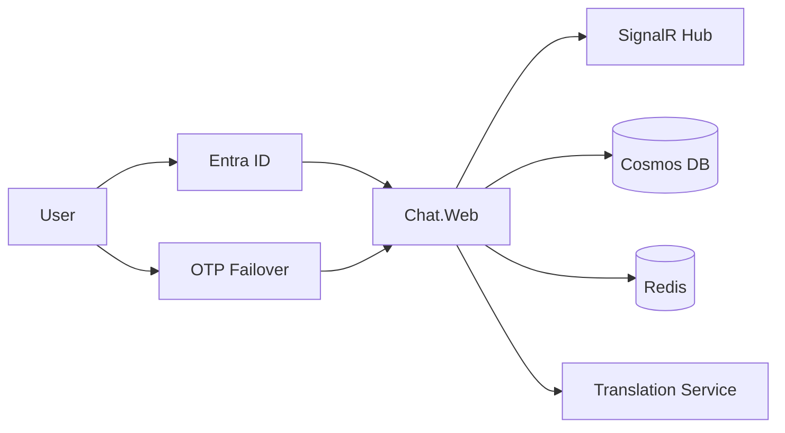

# Architecture Overview

## Summary

The application enables chat between paired dispatch centers and escalates unread messages to officers assigned to the counterpart dispatch center.

```mermaid
flowchart LR
    User[User]
    Entra[Entra ID]
    Otp[OTP Failover]
    Web[Chat.Web]
    SignalR[SignalR Hub]
    Cosmos[(Cosmos DB)]
    Redis[(Redis)]
    Translator[Translation Service]

    User --> Entra
    User --> Otp
    Entra --> Web
    Otp --> Web
    Web --> SignalR
    Web --> Cosmos
    Web --> Redis
    Web --> Translator
```

## Core Subsystems

### Identity

- Entra ID for enterprise sign-in
- OTP fallback for failover login
- strict pre-provisioned user lookup by `Upn`

### Topology

- dispatch centers define allowed communication pairs
- users belong to one dispatch center
- rooms are derived from dispatch-center topology

### Chat

- realtime messaging via SignalR
- pair-room authorization via dispatch center membership
- read state tracked per user and per dispatch center

### Escalations

- scheduled unread escalation
- manual escalation for selected messages
- notifications sent to all officers of the target dispatch center

### Translation

- asynchronous queue-based translation
- room languages aggregated from assigned users

## Persistence

Cosmos DB stores:

- users
- dispatch centers
- rooms
- messages
- escalations

Redis stores:

- presence
- OTP state
- translation queue state

## Important Constraints

- no standard chat rooms
- no manual room management
- no seeded user/room assumptions
- no legacy room assignment compatibility
