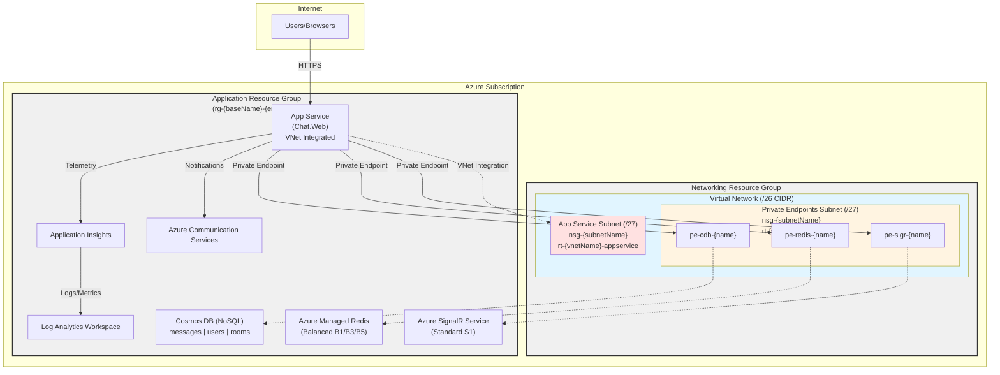
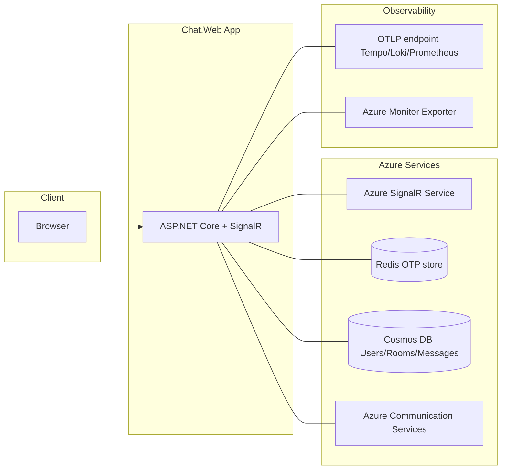
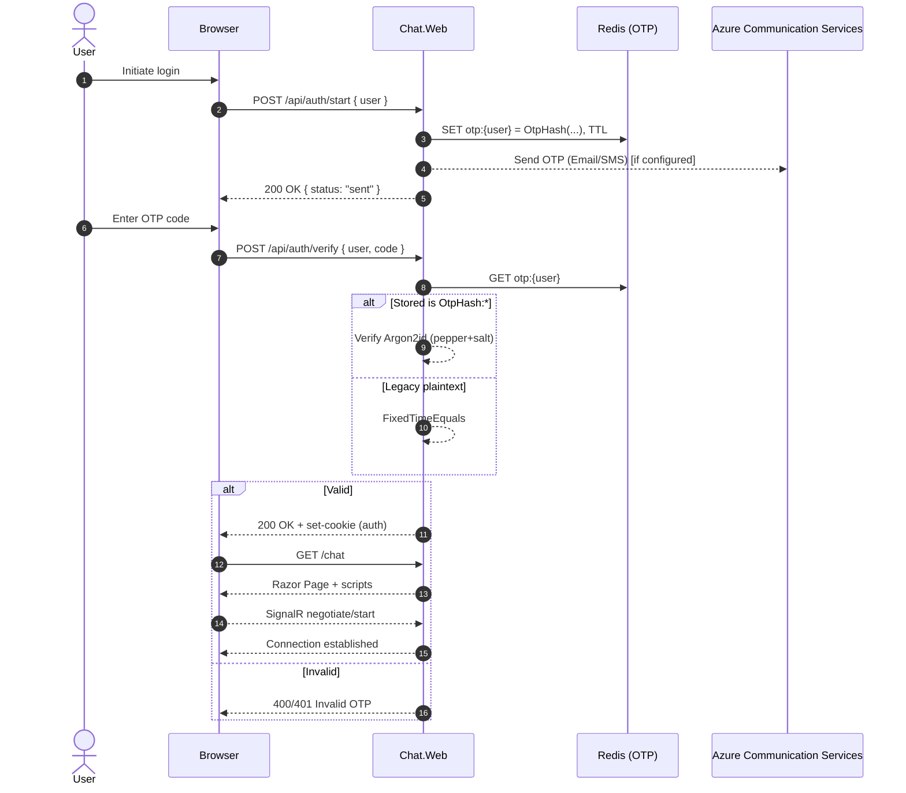
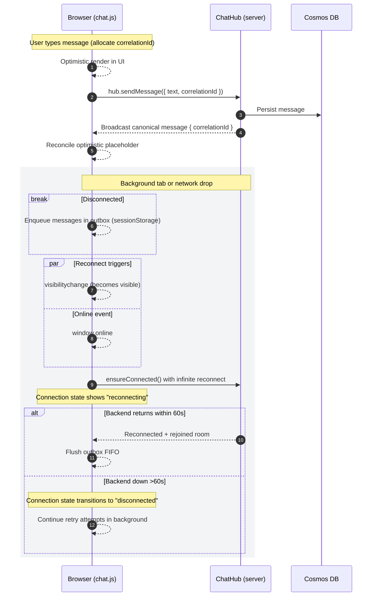
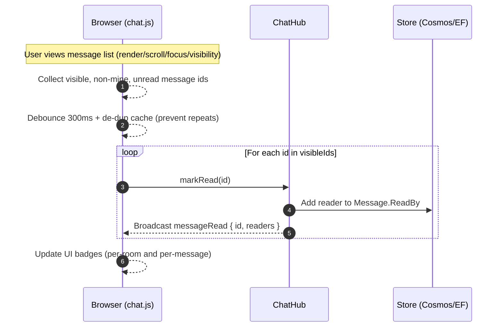

# Architecture

This document describes the high-level architecture of SignalR-Chat with focus on infrastructure provisioning, OTP hashing implementation, and runtime components.

## Table of Contents

- [Infrastructure as Code (Bicep)](#infrastructure-as-code-bicep)
- [Diagrams](#diagrams)
- [Runtime Overview](#runtime-overview)
- [OTP Authentication and Hashing](#otp-authentication-and-hashing)
- [Observability](#observability)
- [Cosmos Messages Retention (TTL)](#cosmos-messages-retention-ttl)
- [Localization](#localization)
- [Current Overview](#current-overview)
- [Key Components](#key-components)
- [SignalR Role](#signalr-role)
- [Redis Role](#redis-role)
- [Runtime Flows](#runtime-flows)
- [Build & Front-End Delivery](#build--front-end-delivery)
- [Observability & Telemetry](#observability--telemetry)
- [Scaling Considerations](#scaling-considerations)
- [Security Notes](#security-notes)
- [Future Roadmap (Prioritized)](#future-roadmap-prioritized)
- [Glossary](#glossary)
- [Data Schemas](#data-schemas)

---

## Infrastructure as Code (Bicep)

The application uses **Azure Bicep** templates for reproducible infrastructure deployments across dev, staging, and production environments. All deployments are automated through **GitHub Actions** with environment-specific configurations.

### Infrastructure Components

| Component | Purpose | Configuration |
|-----------|---------|---------------|
| **Resource Groups** | Separate infrastructure isolation | Networking RG + Application RG per environment |
| **Virtual Network** | Network isolation with TWO dedicated subnets | /26 CIDR per environment (deployed in networking RG) |
| **Network Security Groups** | Security rules per subnet | Named `nsg-{subnetName}` (deployed in networking RG) |
| **Route Tables** | Traffic routing per subnet | Named `rt-{vnetName}-{type}` (deployed in networking RG) |
| **App Service Subnet** | Delegated to `Microsoft.Web/serverFarms` for VNet integration | /27 CIDR (first subnet) |
| **Private Endpoints Subnet** | Secure Azure service connections with private endpoints | /27 CIDR (second subnet) |
| **Log Analytics Workspace** | Centralized logging and monitoring | 30/90/365 day retention (deployed in application RG) |
| **Application Insights** | Application performance monitoring | Workspace-based (not classic, deployed in application RG) |
| **Cosmos DB** | NoSQL database with 3 containers | Zone-redundant for all environments, geo-replication for prod (deployed in application RG) |
| **Azure Managed Redis** | OTP storage, session cache, presence tracking | Balanced_B1 (dev), Balanced_B3 (staging/prod) (deployed in application RG) |
| **Azure SignalR Service** | Real-time communication hub | Standard_S1 for all environments (1/1/5 units) (deployed in application RG) |
| **Azure Communication Services** | Email and SMS capabilities | Global resource, Europe data location (deployed in application RG) |
| **App Service Plan** | Web application hosting | P0V4 PremiumV4 Windows for all environments (deployed in application RG) |
| **App Service (Web App)** | SignalR Chat application | .NET 9.0 runtime, Windows OS, VNet integrated with outbound routing, HTTPS-only, TLS 1.2, identity disabled (deployed in application RG) |
| **Private Endpoints** | Secure connections to Cosmos DB, Redis, SignalR | Deployed in private endpoints subnet with DNS zone integration (cross-RG references) |

### Network Architecture (Critical Requirement)

Each environment has **TWO separate resource groups**:

**1. Networking Resource Group** (`rg-vnet-{baseName}-{environment}-{shortLocation}`):
- Virtual Network (/26 CIDR)
- Network Security Groups (NSGs): `nsg-{subnetName}` format
- Route Tables: `rt-{vnetName}-appservice`, `rt-{vnetName}-pe`
- TWO subnets (/27 each):
  - **App Service Subnet** (e.g., `10.0.0.0/27`): VNet integration, route table with Internet route
  - **Private Endpoints Subnet** (e.g., `10.0.0.32/27`): Private endpoint connections, empty route table

**2. Application Resource Group** (`rg-{baseName}-{environment}-{shortLocation}`):
- App Service Plan & Web App (references VNet from networking RG)
- Cosmos DB + Private Endpoint (in networking RG subnet)
- Redis + Private Endpoint (in networking RG subnet)
- SignalR + Private Endpoint (in networking RG subnet)
- Azure Communication Services
- Monitoring (Log Analytics + Application Insights)

**Subnet Details:**

1. **App Service Subnet** (First subnet):
   - Purpose: VNet integration for App Service
   - Delegation: `Microsoft.Web/serverFarms`
   - NSG: `nsg-{subnetName}` (e.g., `nsg-10-0-0-0--27`)
   - Route Table: `rt-{vnetName}-appservice` with default Internet route (0.0.0.0/0 → Internet)
   - NSG Rules: Allow HTTPS (443), HTTP (80) inbound
   - Connected to: App Service via VNet integration
   - Naming: IP-based format (e.g., `10-0-0-0--27` for 10.0.0.0/27)

2. **Private Endpoints Subnet** (Second subnet):
   - Purpose: Private Endpoint connections to Cosmos DB, Redis, SignalR
   - NSG: `nsg-{subnetName}` (e.g., `nsg-10-0-0-32--27`)
   - Route Table: `rt-{vnetName}-pe` (no routes configured)
   - NSG Rules: Restrictive rules for internal traffic only
   - Private Endpoints: Cosmos DB (Sql), Redis (redisEnterprise), SignalR (signalr)
   - Naming: IP-based format (e.g., `10-0-0-32--27` for 10.0.0.32/27)

### Deployment Strategy

**GitHub Actions Only** (`.github/workflows/deploy-infrastructure.yml`):
- All deployments are triggered via GitHub Actions workflow
- Environment selection: dev, staging, prod (manual dispatch)
- Approval gates required for production deployments
- Automatic what-if preview before deployment
- Post-deployment validation (2 subnets check)
- Database seeding after successful deployment
- Optional teardown action for cleanup

### VNet Integration and Private Endpoints

The application uses **VNet integration with outbound traffic routing** to access Azure services through private endpoints instead of public internet:

**App Service Configuration:**
- **VNet Integration**: Connected to App Service subnet (delegated to Microsoft.Web/serverFarms)
- **Outbound VNet Routing**: `outboundVnetRouting.allTraffic = true` (configured via Bicep)
  - Routes ALL outbound traffic through the VNet (application, backup/restore, content share, image pull)
  - Replaces deprecated `siteConfig.vnetRouteAllEnabled` property
  - Required for Windows App Services to use private endpoints
- **Custom DNS**: VNet configured with custom DNS server (hub DNS forwarder) for private endpoint resolution
- **Result**: All connections to Cosmos DB, Redis, and SignalR use private IP addresses (10.x.x.x range)

**Private Endpoint Configuration:**
- **Cosmos DB**: Private endpoint in private endpoints subnet with static IPs (.36, .37)
- **Redis**: Private endpoint with static IP (.38)
- **SignalR**: Private endpoint with static IP (.39)
- **DNS Integration**: Private endpoints use hub-managed private DNS zones
  - Requires VNet link to hub private DNS zones (e.g., privatelink.documents.azure.com)
  - Custom DNS server on VNet resolves private endpoint FQDNs to private IPs
- **Network Policies**: `privateEndpointNetworkPolicies = Disabled` on both subnets

**Security Benefits:**
- No public internet exposure for backend service connections
- Traffic stays within Azure backbone network
- Cosmos DB firewall blocks all public internet access
- Reduced attack surface and improved compliance posture

**Environment Variables** (GitHub repository secrets/variables):
All 7 parameters are configured per environment as GitHub variables:
- `BICEP_BASE_NAME`: Base name for resources (e.g., `signalrchat`)
- `BICEP_LOCATION`: Azure region (e.g., `polandcentral`)
- `BICEP_SHORT_LOCATION`: Short location code (e.g., `plc` for polandcentral)
- `BICEP_VNET_ADDRESS_PREFIX`: VNet CIDR (e.g., `10.0.0.0/26`)
- `BICEP_APP_SERVICE_SUBNET_PREFIX`: First subnet CIDR (e.g., `10.0.0.0/27`)
- `BICEP_PRIVATE_ENDPOINTS_SUBNET_PREFIX`: Second subnet CIDR (e.g., `10.0.0.32/27`)
- `BICEP_ACS_DATA_LOCATION`: ACS data location (e.g., `Europe`)

**Resource Naming Convention** (from issue #84 + shortLocation):
```
Networking Resource Group:  rg-vnet-{codename}-{env}-{shortloc}
Application Resource Group: rg-{codename}-{env}-{shortloc}
App Service Plan:            serverfarm-{codename}-{env}-{shortloc}
App Service:                 {codename}-{env}-{shortloc}
Cosmos DB:                   cdb-{codename}-{env}-{shortloc}
Redis:                       redis-{codename}-{env}-{shortloc}
SignalR:                     sigr-{codename}-{env}-{shortloc}
ACS:                         acs-{codename}-{env}
App Insights:                ai-{codename}-{env}-{shortloc}
Log Analytics:               law-{codename}-{env}-{shortloc}
Virtual Network:             vnet-{codename}-{env}-{shortloc}
Network Security Group:      nsg-{subnetname}
Route Table:                 rt-{vnetname}-{type}
Private Endpoint:            pe-{resourcename}
PE Network Interface:        nic-pe-{resourcename}
```

Examples:
- Networking RG: `rg-vnet-signalrchat-dev-plc`
- Application RG: `rg-signalrchat-dev-plc`
- Virtual Network: `vnet-signalrchat-dev-plc`
- NSG (App Service): `nsg-10-0-0-0--27`
- Route Table (App Service): `rt-vnet-signalrchat-dev-plc-appservice`
- App Service: `signalrchat-prod-plc`
- Cosmos DB: `cdb-signalrchat-staging-plc`
- Private Endpoint: `pe-redis-signalrchat-dev-plc`

### Environment SKU Matrix

| Resource | Dev | Staging | Production |
|----------|-----|---------|------------|
| App Service Plan | P0V4 PremiumV4 Windows (1 instance, no AZ) | P0V4 PremiumV4 Windows (2 instances, AZ) | P0V4 PremiumV4 Windows (3 instances, AZ) |
| Cosmos DB | Zone-redundant, single region | Zone-redundant, single region | Zone-redundant, multi-region (polandcentral + germanywestcentral) |
| Redis Cache | Balanced_B1 (Azure Managed Redis) | Balanced_B3 (Azure Managed Redis) | Balanced_B5 (Azure Managed Redis) |
| SignalR Service | Standard_S1 (1 unit) | Standard_S1 (1 unit) | Standard_S1 (5 units) |
| Log Analytics | 30-day retention, 1 GB cap | 90-day retention, 5 GB cap | 365-day retention, 10 GB cap |
| Private Endpoints | Enabled for all services | Enabled for all services | Enabled for all services |

### Cost Estimates
- **Development**: ~$150-250/month (P0V4 + Standard SignalR + Managed Redis)
- **Staging**: ~$350-500/month (2 instances + zone redundancy)
- **Production**: ~$1200-1800/month (3 instances + multi-region + 5 SignalR units)

### Deployment Documentation

For detailed deployment instructions, see:
- **[Infrastructure README](infra/bicep/README.md)**: Complete Bicep documentation with architecture diagrams, deployment steps, and troubleshooting
- **[Bootstrap Guide](docs/BOOTSTRAP.md)**: Step-by-step guide for infrastructure provisioning and data seeding

---

## Diagrams

The following Mermaid diagrams visualize the system components and key runtime flows.

### Infrastructure Architecture (Azure)



Notes:
- Each environment has **two separate resource groups** (networking + application)
- Networking RG contains VNet, NSGs, and Route Tables
- Application RG contains all application services
- VNet has **exactly TWO subnets** (/27 each within /26 VNet)
- App Service subnet has route table with Internet route (0.0.0.0/0 → Internet)
- Private Endpoints subnet has route table with no routes
- NSGs named `nsg-{subnetName}` (IP-based subnet naming)
- Route Tables named `rt-{vnetName}-{type}`
- Cross-resource-group references enable VNet integration and private endpoints
- All resources follow naming convention: `{type}-{baseName}-{env}-{shortLoc}`

### System Architecture (Runtime)



Notes:
- Azure SignalR is used in non-test modes; in Testing:InMemory the app uses in-process SignalR only.
- Redis is used for OTP storage, rate limiting counters, and presence tracking; messages/users/rooms are stored in Cosmos DB.
- Observability exporters are selected by configuration: Azure Monitor > OTLP > Console.

### OTP authentication flow



### Messaging, optimistic UI, and reconnect



### Connection States

The client-side connection state logic (`computeConnectionState()` in `chat.js`) determines which visual state to display based on multiple factors:

**States**:
- **`connected`**: Normal operation, SignalR connected and backend healthy
- **`reconnecting`**: Actively attempting to reconnect (graceful degradation during temporary network issues)
- **`degraded`**: SignalR connected but backend services (Redis/Cosmos) unhealthy
- **`disconnected`**: No connection or backend down for extended period

**Timing Thresholds**:
| Threshold | Duration | Purpose |
|-----------|----------|---------|
| Automatic reconnect grace | 60s | Trust "reconnecting" state during SignalR's automatic reconnect attempts |
| Manual reconnect timeout | 10s | Show "disconnected" after 10s of failed manual reconnects (backend down) |
| Recent state trust window | 5s | Trust event-driven state updates within last 5 seconds |
| Health check freshness | 30s | Use health check results if less than 30s old |
| Hub stuck timeout | 60s | Show "disconnected" if hub stuck in `connecting`/`reconnecting` for >60s |

**State Determination Logic**:
1. If actively reconnecting via SignalR automatic reconnect (< 60s), show **reconnecting**
2. If manually reconnecting (< 10s), show **reconnecting**; if manual reconnect > 10s, show **disconnected**
3. If SignalR connected but health check shows backend unhealthy (< 30s old), show **degraded**
4. If recent event-driven state change (< 5s), trust that state
5. Fall back to polling hub state:
   - If hub state is `connected`, show **connected**
   - If hub stuck in `connecting` or `reconnecting` for > 60s, show **disconnected** (fixes bug where UI showed "reconnecting" indefinitely)
   - Otherwise, show **reconnecting** or **disconnected** based on hub state

**Visual Indicators**:
- **Connected**: Normal appearance
- **Reconnecting**: Room title appends "(RECONNECTING…)"
- **Degraded**: Room title appends "(⚠️ LIMITED)" - warning but less severe
- **Disconnected**: Room title appends "(⚠️ DISCONNECTED)" - critical state

**Background Behavior**: Even when UI shows "disconnected" after 60s, reconnection attempts continue in the background with exponential backoff. When connection is restored, the UI immediately transitions back to "connected".

### Read receipts flow



## Runtime overview
- ASP.NET Core 9 (Razor Pages + Controllers + SignalR Hub)
- Persistence: Azure Cosmos DB with custom repository pattern; in-memory repositories when Testing:InMemory mode enabled
- OTP store: Redis in normal mode, in-memory in Testing:InMemory
- Auth: Cookie authentication after OTP verification (dedicated `/login` page)
- Localization: ASP.NET Core Localization with 8 supported markets (en, pl-PL, de-DE, cs-CZ, sk-SK, uk-UA, lt-LT, ru-RU); culture resolution via Cookie > Accept-Language header; API endpoint (`/api/localization/strings`) provides client-side translations
- Observability: OpenTelemetry (traces, metrics, logs) with exporter auto-selection
- SignalR transport: In-process by default; Azure SignalR is automatically added when not in Testing:InMemory mode
- Read receipts: Client marks messages as read in two ways: (1) on reaching timeline bottom (existing), and (2) after join/reconnect by scanning the viewport for visible, non-self messages and invoking `markRead` per id (debounced, idempotent). This ensures historical messages seen on reconnect are recorded as read.

## OTP authentication and hashing

### Goals
- Avoid storing OTP codes in plaintext while preserving a simple UX.
- Support a migration path from legacy plaintext values without breaking existing sessions.
- Keep implementation configurable and versioned for future upgrades.

### Components
- `IOtpHasher` (src/Chat.Web/Services/IOtpHasher.cs)
  - Contract: `string Hash(string userName, string code)` and `VerificationResult Verify(string userName, string code, string stored)`
  - `VerificationResult` has `IsMatch` and `NeedsRehash` flags.
- `Argon2OtpHasher` (src/Chat.Web/Services/Argon2OtpHasher.cs)
  - Uses Isopoh.Cryptography.Argon2 (managed .NET implementation)
  - Algorithm: Argon2id (HybridAddressing in Isopoh enum)
  - Per-code random 16-byte salt
  - Preimage: `pepper || userName || ':' || salt || ':' || code`
  - Stores a versioned record with explicit KDF parameters:
    - Format: `OtpHash:v2:argon2id:m={KB},t={it},p={par}:{saltB64}:{encoded}`
    - `encoded` is the library’s PHC-style encoded string for the computed hash
  - Verification: recomputes the same preimage using the stored salt and calls `Argon2.Verify(encoded, preimage, threads)`
  - `NeedsRehash` is true when configured parameters are stronger than those embedded in the stored record
- `OtpOptions` (src/Chat.Web/Options/OtpOptions.cs)
  - `Pepper` (Base64 string) – load from environment variable `Otp__Pepper`
  - `HashingEnabled` (default true)
  - Argon2 parameters: `MemoryKB`, `Iterations`, `Parallelism`, `OutputLength`

### DI and configuration
- Registered in `Startup.ConfigureServices`:
  - `services.Configure<OtpOptions>(Configuration.GetSection("Otp"));`
  - `services.PostConfigure<OtpOptions>(...)` reads `Otp__Pepper` from environment when present
  - `services.AddSingleton<IOtpHasher, Argon2OtpHasher>();`
- OTP store selection:
  - Testing:InMemory=true → `InMemoryOtpStore`
  - Otherwise → Redis via `IConnectionMultiplexer` and `RedisOtpStore`
- Sender selection:
  - If ACS configured → `AcsOtpSender`
  - Else → `ConsoleOtpSender` (writes OTP to console for local development)

### Controller behavior
- `AuthController`:
  - Start
    - Reuses unexpired plaintext OTP only for legacy values (non-hashed); otherwise generates a new code
    - Stores `OtpHash:...` when `HashingEnabled=true`, else plaintext (testing/legacy)
    - Sends the OTP using primary channel (email or phone) with console fallback
  - Verify
    - Reads stored value; if begins with `OtpHash:` → use `IOtpHasher.Verify`
    - Else (legacy plaintext) → constant-time comparison via `CryptographicOperations.FixedTimeEquals`
    - On success: deletes the OTP entry and issues a cookie auth ticket
    - Redirects: Accepts an optional `ReturnUrl` but validates it server-side with `Url.IsLocalUrl`. The API responds with `{ nextUrl: "/chat" | <safe local path> }`. The client navigates to this `nextUrl`.

### Login page behavior
- `GET /login`: If already authenticated and a `ReturnUrl` query param is present, the server validates it with `Url.IsLocalUrl` and performs `LocalRedirect` to a safe path (default `/chat`).
- Client script exposes a sanitized `window.__returnUrl` for UX purposes, but the server remains the source of truth.

### Security considerations
- OTP hashing: Pepper is required for meaningful hashing; use a high-entropy Base64 value (>= 32 bytes) per environment. Keep `HashingEnabled=true` in all non-test environments. The stored format is versioned to allow future upgrades without breaking verification.
- OTP attempt rate limiting: Per-user failed verification attempts are tracked in Redis (`otp_attempts:{userName}`) with atomic counters. After reaching the threshold (default: 5 attempts), verification requests are blocked for the TTL duration (5 minutes, synchronized with OTP expiry). This prevents brute-force attacks while allowing legitimate retries for typos. The implementation uses fail-open strategy on Redis errors to maintain availability.
- Redirect validation: All redirect targets are validated server-side using `Url.IsLocalUrl`. The client uses server-issued `nextUrl` values for navigation after verification.
- DOM XSS hardening: UI rendering avoids `innerHTML` when dealing with user-derived content; code uses `textContent` and element creation.
- Rate limiting: Multi-layer protection includes per-IP endpoint rate limiting (20 req/5s) and per-user OTP attempt limiting (5 attempts/5 min).
- Log forging mitigation: `RequestTracingMiddleware` sanitizes request method and path before logging.

## Observability
- Domain counters (Meter `Chat.Web`): `chat.otp.requests`, `chat.otp.verifications`, `chat.otp.verifications.ratelimited`, plus chat-centric metrics.
- OpenTelemetry exporters are chosen in priority order: Azure Monitor (Production) → OTLP → Console.
- Serilog OTLP sink is enabled only when `OTel__OtlpEndpoint` is present.
- Serilog console output (stdout; errors to stderr) is controlled by `Serilog__WriteToConsole`.
  - See **[Configuration Guide](../getting-started/configuration.md#logging-configuration)** for defaults and overrides.

## Cosmos messages retention (TTL)
When Cosmos DB repositories are used, the messages container's `DefaultTimeToLive` is managed at startup to match configuration:

- Option: `Cosmos:MessagesTtlSeconds` (nullable integer)
  - `null` or unset/empty → TTL disabled (container DefaultTimeToLive cleared)
  - `-1` → TTL enabled but items never expire by default (Cosmos semantics)
  - `> 0` seconds → items expire after the configured lifetime
- Reconciliation: The application reads the current container properties and updates `DefaultTimeToLive` when it differs from the configured value, including clearing it when disabled. This ensures drift correction when config changes between deployments.

## Localization

### Goals
- Support multiple markets with natural, idiomatic translations
- Enable culture-specific user experiences without code changes
- Provide client-side access to localized strings
- Allow culture selection via cookie or Accept-Language header

### Supported Markets (9 total)
The application supports the following cultures with complete translations:

| Culture Code | Language | Region | Notes |
|--------------|----------|--------|-------|
| `en` | English | Default | Fallback culture |
| `pl-PL` | Polish | Poland | |
| `de-DE` | German | Germany | Formal style |
| `cs-CZ` | Czech | Czech Republic | Informal friendly |
| `sk-SK` | Slovak | Slovakia | |
| `uk-UA` | Ukrainian | Ukraine | Modern Ukrainian, Cyrillic |
| `lt-LT` | Lithuanian | Lithuania | Baltic language, Latin script |
| `ru-RU` | Russian | Russia | Standard contemporary Russian, Cyrillic |

### Components

**Resource Files** (`src/Chat.Web/Resources/`)
- `SharedResources.resx` - English (default/fallback)
- `SharedResources.[locale].resx` - Translated resources for each supported culture
- Contains 60+ strings covering:
  - Application common (Loading, Error, Retry, Search)
  - Chat interface (ChatRooms, MessageInputPlaceholder, Reconnecting)
  - Authentication/OTP (SendCode, Verify, SixDigitCode)
  - Date/Time (Today, Yesterday, AM/PM)
  - Error messages (40+ error/validation strings)
  - Email/SMS templates
  - Validation messages

**LocalizationController** (`src/Chat.Web/Controllers/LocalizationController.cs`)
- REST endpoint: `GET /api/localization/strings`
- Returns JSON object with all client-needed translations for current culture
- Response cached (1 hour) with variance on `Cookie` and `Accept-Language` headers
- Used by JavaScript to populate `window.i18n` object

**Startup Configuration** (`src/Chat.Web/Startup.cs`)
```csharp
services.AddLocalization(); // Resources resolved from namespace path
services.Configure<RequestLocalizationOptions>(options =>
{
    var supportedCultures = new[] { /* 9 cultures */ };
    options.DefaultRequestCulture = new RequestCulture("en");
    options.SupportedCultures = supportedCultures;
    options.SupportedUICultures = supportedCultures;
    
    // Priority: Cookie > Accept-Language > Default
    options.RequestCultureProviders = new List<IRequestCultureProvider>
    {
        new CookieRequestCultureProvider(),
        new AcceptLanguageHeaderRequestCultureProvider()
    };
});
```

**Culture Resolution Priority**
1. **Cookie** (`CookieRequestCultureProvider`) - Explicit user preference stored in `.AspNetCore.Culture` cookie
2. **Accept-Language Header** (`AcceptLanguageHeaderRequestCultureProvider`) - Browser language preference
3. **Default** - Falls back to `en` if no match found

### Client Integration

**JavaScript Initialization** (`wwwroot/js/login.js`)
```javascript
// Fetch translations for current culture
const response = await fetch('/api/localization/strings');
const translations = await response.json();
window.i18n = translations;

// Use in UI
document.querySelector('.loading').textContent = window.i18n.Loading;
```

**Culture Switcher**
- UI component on login page allows culture selection
- Sets `.AspNetCore.Culture` cookie with format: `c=CULTURE|uic=CULTURE`
- Page reload applies new culture across all resources

**Razor Page Usage**
```csharp
@inject IStringLocalizer<SharedResources> Localizer

<h1>@Localizer["AppTitle"]</h1>
<p>@Localizer["AppDescription"]</p>
```

### Translation Approach
All translations focus on natural, idiomatic language rather than literal machine translations:
- **German**: Formal business style ("Sie" form throughout)
- **Czech/Slovak**: Informal friendly tone appropriate for chat
- **Ukrainian**: Modern Ukrainian avoiding Russianisms
- **Lithuanian**: Natural Baltic phrasing with proper diacritics

Examples:
- "What's on your mind?" (message placeholder)
  - German: "Was möchten Sie mitteilen?" (formal)
  - Czech: "Co vás napadá?" (friendly)
  - Polish: "Co Ci chodzi po głowie?" (idiomatic)
  - Ukrainian: "Що у вас на думці?" (natural)

### Testing
Comprehensive localization test coverage (`tests/Chat.Tests/LocalizationTests.cs`):
- 55 total tests covering all 9 markets
- Tests per locale:
  - App translations (AppTitle, AppDescription, Loading)
  - UI strings (Error, ChatRooms, SignInToContinue)
  - Authentication strings (SendCode, Verify, SixDigitCode)
  - All 60+ required keys validation
  - Parameterized string formatting (e.g., "Who's Here ({0})")
- Culture-specific test execution using `CultureInfo.CurrentCulture` and `CultureInfo.CurrentUICulture`
- Verifies actual `.resx` file contents match expected translations

Test results: **55/55 passing** ✅

### Future Enhancements
- User preference persistence (database-backed culture choice)
- Additional markets as needed
- RTL (right-to-left) layout support for Arabic/Hebrew
- Pluralization rules for count-based strings
- Date/time format localization
# Architecture

This section captures core components and runtime flows beyond OTP specifics.

## Current Overview
- **Framework**: ASP.NET Core (Razor Pages + minimal MVC endpoints + SignalR Hub)
- **Real-time Transport**: SignalR (in-process hub).
- **Persistence**: Azure Cosmos DB with custom repository pattern (CosmosUsersRepository, CosmosRoomsRepository, CosmosMessagesRepository). In-memory repositories available for testing.
- **Authentication**: Passwordless one-time passcode (OTP) flow. Short-lived OTP codes stored in Redis; successful verification establishes cookie-auth session.
- **Redis Usage**: Only for OTP storage (key prefix `otp:`) with TTL; no chat message caching or SignalR backplane configured yet.
- **Front-End**: Vanilla JavaScript modules (`chat.js`, `site.js`, `login.js`) referenced directly by Razor pages. Optional esbuild step can produce minified bundles in `wwwroot/js/dist/` for production testing.
- **Messaging Model**: All chat messages are sent exclusively through the SignalR hub (`ChatHub`).
- **Removed Feature**: Private/direct messaging (`/private(user)`) removed; only room-based broadcast remains.
- **Client Reliability**: Outbox queue with sessionStorage persistence for messages typed while disconnected or during (re)join. Queue flushes automatically after join / reconnect.
- **Optimistic UI**: Messages render immediately with temporary local metadata and reconcile on authoritative broadcast via correlation ID.
- **Background Connection Behavior**: Infinite reconnect policy with exponential backoff, extended server timeout (~240s) and keep-alives (~20s) to tolerate background tab throttling; proactive ensureConnected on `visibilitychange` and `online` events.
- **Attention UX**: When a new message arrives and the tab is hidden, the document title blinks until the tab is visible again.
- **Telemetry / Observability**: Activity/trace correlation through custom fetch wrapper capturing `X-Trace-Id`; client emits structured telemetry events (join attempts, sends, queue flush metrics); server leverages `ActivitySource` spans in hub operations.

## Key Components
| Layer | Component | Responsibility |
|-------|-----------|----------------|
| Client | `chat.js` | Connection lifecycle (connect/join/reconnect), outbox queue, optimistic sends, reconciling broadcasts, telemetry emission. |
| Client | Read receipts UI | Debounced mark-as-read when timeline bottom is reached and after join/reconnect by scanning visible messages; updates per-message ReadBy badges. |
| Client | `site.js` | General UI behaviors (sidebar toggles, OTP modal workflow, tooltips, message actions UI). |
| Client | `login.js` | OTP authentication flow on `/login` page; culture switcher; localization initialization. |
| Real-time | `ChatHub` | Single entry-point for sending messages and joining rooms. Normalizes routing, enriches tracing, broadcasts canonical message DTOs. Uses Context.Items for per-connection state (user, room). |
| Presence | `IPresenceTracker` / `RedisPresenceTracker` | Tracks user presence across instances using Context.Items (local) + Redis hash (distributed snapshot). |
| Background | `UnreadNotificationScheduler` | Schedules per-message delayed unread checks; sends notifications to recipients excluding sender/readers. |
| Background | `TranslationBackgroundService` | Processes translation jobs with 5 concurrent workers; handles retries and status updates. |
| Services | `NotificationSender` / `AcsOtpSender` | Formats notification payloads and delivers them via email/SMS; enforces notification subject/body contract while preserving OTP formatting. |
| Services | `AzureTranslatorService` | Azure AI Foundry wrapper for message translation; Redis caching with 1-hour TTL. |
| Services | `TranslationJobQueue` | Redis-based FIFO queue for translation jobs; LPUSH/RPOP with priority support. |
| Localization | `LocalizationController` | API endpoint (`/api/localization/strings`) providing JSON translations for current culture; cached with `Accept-Language` header variance. |
| Localization | `SharedResources` | Resource files (`SharedResources.[locale].resx`) containing translated strings for 8 supported cultures. |
| Auth | Auth Controllers / OTP API | `start` (generate/store OTP in Redis), `verify` (validate OTP, issue auth cookie), `logout`. |
| Data | `ApplicationDbContext` & EF migrations | Stores Users, Rooms, Messages. |
| OTP Store | `RedisOtpStore` | Wrapper over StackExchange.Redis for code set/get/delete with TTL. |
| Config | `RedisOptions` | Connection string, DB index, OTP TTL seconds. |
| Build | esbuild tasks (VS Code tasks.json) | Produce minified bundles consumed by layout. |

## SignalR Role
SignalR provides the real-time bi-directional communication channel between browser clients and the server, handling:
- Hub method invocation (client → server: send/join operations)
- Broadcast fan-out scoped to room groups
- Connection lifecycle events used to trigger auto-join and queued message flush
- Basic ordering within a single hub instance (optimistic reconciliation on client covers timing gaps)
- Translation update notifications (server → clients: `TranslationUpdated(messageId)`)

Client read-marking is idempotent and safe across reconnects: the browser deduplicates per-session with a small cache and the server persists unique readers per message. No bulk API is required; a future optimization could add a `markReadMany` hub method if needed.

## Translation Architecture

**Phase 2 Implementation** (December 2025): Asynchronous AI-powered message translation using Azure AI Foundry (GPT-4o-mini).

**Overview:**
- Messages are immediately broadcast, then asynchronously translated in background
- Source language is derived from sender preference (or `auto`)
- Target languages are derived from the room language set (plus always `en`)
- Redis-based FIFO queue with 5 concurrent workers
- Automatic retry logic (max 3 attempts) with exponential backoff
- Redis caching with 1-hour TTL reduces API costs by 40-60%
- Real-time SignalR updates when translations complete

**Key Components:**

| Component | Technology | Purpose |
|-----------|-----------|---------|
| Translation Queue | Redis (FIFO) | LPUSH/RPOP job queue with priority support |
| Background Workers | IHostedService | 5 concurrent workers processing translation jobs |
| AI Translation | Azure AI Foundry (GPT-4o-mini) | Serverless API for message translation |
| Translation Cache | Redis | 1-hour TTL cache for common phrases |
| Translation Status | Message Model | Lifecycle tracking: None → Pending → InProgress → Completed/Failed |

**Translation Flow:**
1. User sends message → Saved to Cosmos DB (status: Pending when translation is enabled) → Broadcast to room
2. Translation job enqueued to Redis queue (LPUSH)
3. Background worker dequeues job (RPOP)
4. Worker updates status to InProgress
5. Call Azure AI Translator API (check cache first)
6. On success: Update message with translations, set status to Completed
7. On failure: Retry (max 3 attempts), then set status to Failed
8. SignalR broadcast `TranslationUpdated(messageId)` to all room members
9. Clients fetch updated message and display translations

**Configuration:**
```json
{
  "Translation": {
    "Enabled": true,
    "QueueName": "translation:queue",
    "MaxConcurrentJobs": 5,
    "MaxRetries": 3
  }
}
```

**Performance:**
- Message send latency: <50ms (non-blocking)
- Translation latency: 1-3 seconds per message (depends on room language set)
- Queue throughput: 5-10 jobs/second
- Cache hit rate: 40-60%

**Testing:**
- 23 unit tests (models, queue operations, priority handling)
- 8 integration tests (end-to-end translation, caching, tone preservation)
- **Total: 31/31 translation tests passing (100%)**

**For detailed architecture, see:** [Translation Architecture](./translation-architecture.md)

Azure SignalR is used when not running in Testing:InMemory mode; otherwise in-process SignalR is used. No Redis backplane is configured; multi-instance scale-out could use Redis backplane as an alternative.

## Redis Role
Redis serves three purposes:
1. **OTP storage**: Key pattern `otp:{userName}` with versioned Argon2id hash (format `OtpHash:v2:argon2id:...`) and TTL (default 300s)
2. **OTP attempt rate limiting**: Key pattern `otp_attempts:{userName}` with atomic INCR counter and TTL (default 300s) to prevent brute-force attacks
3. **Presence tracking**: Single hash key `presence:users` stores current user presence for cross-instance snapshot queries

Operations:
- OTP: set, get, remove via `RedisOtpStore` with retry + cooldown guards
- OTP Attempts: atomic INCR with conditional EXPIRE (TTL set only on first attempt) via `RedisOtpStore`
- Presence: HSET/HGET/HDEL via `RedisPresenceTracker` for distributed user state

Potential future roles: SignalR backplane, rate limiting, hot message cache.

## Runtime Flows
### OTP Authentication
1. Client POSTs `/api/auth/start` (generate + store OTP in Redis)
2. User receives/displayed code out-of-band via ACS (email/SMS) when configured; otherwise written to console for local development
3. Client POSTs `/api/auth/verify` with code
   - Server checks failed attempt count (`otp_attempts:{userName}`)
   - If count >= threshold (default: 5), request is blocked (401 Unauthorized)
   - Server validates OTP hash
   - On failure: increment attempt counter with TTL (5 minutes), return 401
   - On success: issue auth cookie, clear attempt counter
4. Client opens SignalR connection and auto-joins a room; outbox flush begins

**Security**: Multi-layer rate limiting (per-IP endpoint limiting + per-user attempt limiting) with OpenTelemetry metrics (chat.otp.verifications.ratelimited) to prevent brute-force attacks.

### Auto-Join & Queue Flush
- Determine target room (user default, only room, or first) then invoke hub join
- Drain sessionStorage queue FIFO, sending each with preserved correlationId

### Optimistic Send
1. User action → allocate correlationId + temporary placeholder
2. If connected: send through hub; if not: enqueue
3. Hub persists and broadcasts canonical message (includes correlationId)
4. Client reconciles & finalizes

### Reconnect Handling
- Messages composed offline accumulate in queue
- On reconnection + join success, queued messages flush automatically
- Proactive reconnect is attempted on `visibilitychange` (when becoming visible) and `online` events

### Post-join/read reconciliation (viewport-based)
1. After a successful join or reconnect, the client triggers a debounced scan of the message list.
2. It computes which messages are currently visible in the viewport, excludes messages authored by the current user, and ignores any ids it already marked in this session.
3. For each remaining id, it invokes the hub `markRead(id)`. Calls are debounced (300ms) and idempotent server-side.
4. Upon `messageRead` broadcasts, the UI updates per-message badges and any per-room unread counters.

### Unread notification scheduling
1. On message send, the server schedules a delayed check for that message using `UnreadNotificationScheduler`.
2. After `Notifications:UnreadDelaySeconds` (default 60), the scheduler queries the message state.
3. If the message is still unread by all recipients, it computes recipients:
  - Primary: `room.users` when present
  - Fallback: users whose `fixedRooms` contains the room name
  - Excludes: the sender and any users in `message.readBy`
4. `NotificationSender` sends one notification per recipient through the configured channels.

Formatting contract:
- Email subject: `New message`
- Email body: `New message in #<room>`
- SMS body: `New message in #<room>`
- No message text is included to avoid leaking content through notifications.

### Presence tracking
The application tracks which users are currently online and in which rooms using a hybrid approach:

1. **Per-connection state (Context.Items)**:
   - When a user connects, `OnConnectedAsync` stores `UserViewModel` in `Context.Items["UserProfile"]`
   - Current room is tracked in `Context.Items["CurrentRoom"]`
   - This provides instant access in hub methods (SendMessage, MarkRead) without Redis queries
   - Automatically cleaned up when connection closes

2. **Distributed snapshot (Redis)**:
   - Single hash key: `presence:users`
   - Hash fields: `{userName}` → JSON-serialized `UserViewModel` with `CurrentRoom`
   - Updated on: Join (room change), OnConnectedAsync (initial), OnDisconnectedAsync (cleanup)
   - TTL: 10 minutes, refreshed on updates
   - Used by: GetUsers (cross-instance queries), presence API endpoint

3. **Multi-instance coordination**:
   - `_UserConnectionCounts` (ConcurrentDictionary) tracks per-instance connection counts
   - Only removes from Redis when last connection for that user (on this instance) closes
   - SignalR groups handle cross-instance message broadcasting

4. **Interfaces**:
   - `IPresenceTracker`: Simplified interface (4 methods: SetUserRoomAsync, GetUserAsync, RemoveUserAsync, GetAllUsersAsync)
   - `RedisPresenceTracker`: Production implementation using Redis hash operations (no key scanning)
   - `InMemoryPresenceTracker`: Test/dev implementation using ConcurrentDictionary

Benefits:
- Fast: No Redis queries in hot path (SendMessage, MarkRead)
- Simple: Context.Items is single source of truth per connection
- Scalable: Hash operations instead of key scanning
- Reliable: Per-connection scope, automatic cleanup, TTL safety net

## Build & Front-End Delivery
- Source JS under `wwwroot/js/` is used directly in development and referenced by pages. Optional build tasks can create minified bundles in `wwwroot/js/dist/` for production testing; pages do not reference `dist` by default.

## Observability & Telemetry
- Server Activities wrap hub operations; `X-Trace-Id` header surfaces trace id to client
- Client logs join attempts, send outcomes, queue flush metrics; correlates with trace id

## Scaling Considerations
| Concern | Current State | Scale-out Path |
|---------|---------------|----------------|
| Real-time fan-out | Single hub instance | Add Redis backplane or Azure SignalR Service |
| Message persistence | Single EF DB | Shard or move to partitioned store |
| OTP store | Single Redis | Managed/clustered Redis |
| Outbox durability | sessionStorage | IndexedDB or server-side queue |
| Presence tracking | Redis hash (single key) | Sharded Redis or dedicated presence service |

## Security Notes
- **HTTP Strict Transport Security (HSTS)**: Production-ready HSTS configuration protects against protocol downgrade attacks:
  - 1-year max-age (31536000 seconds) extends protection window from default 30 days
  - `Preload` directive enabled for HSTS preload list eligibility (https://hstspreload.org/)
  - `IncludeSubDomains` enabled to protect all subdomains
  - Only applied in Production environment (not in test mode via `Testing:InMemory`)
  - Configured in `Startup.ConfigureServices` using `services.AddHsts()` with custom options
  - Activated in `Startup.Configure` via `app.UseHsts()` (Production only)
  - Expected header: `Strict-Transport-Security: max-age=31536000; includeSubDomains; preload`
  - Mitigates first-visit vulnerability and man-in-the-middle attacks
  - Certificate renewal must remain automated (Azure App Service handles this automatically)
- **Network Access Control**:
  - **Cosmos DB**: Private endpoint only (public access disabled when private endpoint configured)
  - **Redis**: Private endpoint only (public access disabled when private endpoint configured)
  - **SignalR**: Dual access mode with network ACLs
    - Dev: All traffic types allowed on public endpoint (ServerConnection, ClientConnection, RESTAPI, Trace)
    - Staging/Prod: Only ClientConnection allowed on public endpoint
    - Private endpoint: All traffic types allowed (all environments)
  - **App Service**: Dual access mode (public + private endpoints both enabled)
  - All services use TLS 1.2 minimum
- **Static IP Allocation**: Private endpoints use deterministic static IPs for reliable network configuration:
  - Cosmos DB: .36 (global) + .37 (regional)
  - Redis: .38
  - SignalR: .39
  - App Service: .40
- OTP codes are stored hashed by default (Argon2id + salt + pepper). Legacy/plaintext verification is supported only when explicitly enabled for testing and uses constant-time comparison. Provide a high-entropy Base64 pepper per environment via `Otp__Pepper`.
- Correlation IDs are opaque UUIDs (avoid embedding user data)
- OTP endpoints are rate-limited.
- Exception handling: Cosmos message `MarkRead` now rethrows with contextual information (message id and sanitized partition/room) instead of logging and rethrowing, aligning with static analysis guidance and improving diagnostics without exposing PII.

## Future Roadmap (Prioritized)
1. Typing indicators
2. Backplane scale-out metrics & multi-instance benchmarks
3. Enhanced pagination UX/accessibility
4. Additional OTP anti-abuse policies (per-user/IP counters in Redis)

## Glossary
- **CorrelationId**: UUID bridging optimistic send and server broadcast
- **Outbox Queue**: Client sessionStorage FIFO of unsent messages
- **OTP**: Short-lived passcode enabling passwordless login
- **Hub**: SignalR abstraction for connections, groups, messaging

## Data schemas

This section documents the canonical shapes for the three core entities used by the application: user, room, and message.

Notes on storage:
- The domain models use custom repository interfaces (IUsersRepository, IRoomsRepository, IMessagesRepository) with Cosmos DB and in-memory implementations.
- Cosmos repositories use Microsoft.Azure.Cosmos SDK directly with custom query building.
- Admin tooling may emit slightly different field names; compatibility rules are noted per entity.

### User

Purpose: Identity for OTP login, room authorization, and message attribution.

Canonical fields:
- userName: string (login/display identity; primary key in Cosmos DB partition /userName)
- fullName: string | null
- avatar: string | null (URL or slug; optional)
- enabled: boolean (default true) — determines if the user is allowed to sign in
- email: string | null
- mobileNumber: string | null (E.164 recommended)
- fixedRooms: string[] (room names the user may join; enforced server-side)
- defaultRoom: string | null (preferred room to auto-join; derived when not provided)
- upn: string | null (Entra ID User Principal Name for enterprise authentication)
- tenantId: string | null (Entra ID tenant GUID)

Note: Cosmos DB auto-generates the `id` field. The application uses `userName` as the document ID and partition key.

Relationships (relational model):
- Messages (one-to-many via Message.FromUser)
- Rooms (navigation-only convenience; joining is governed by FixedRooms, not a join table)

Cosmos compatibility:
- Some documents may store `rooms` instead of `fixedRooms`. The repository accepts either; when both present, `fixedRooms` wins.
- If `defaultRoom` is missing, the app derives it: if there is exactly one allowed room → that one; otherwise the first name in alphabetical order.

Example (logical JSON shape):
```
{
  "id": "alice@example.com",
  "userName": "alice@example.com",
  "fullName": "Alice A.",
  "avatar": null,
  "enabled": true,
  "email": "alice@example.com",
  "mobileNumber": "+12065551234",
  "fixedRooms": ["general", "ops"],
  "defaultRoom": "general"
}
```

### Room

Purpose: Public channel for posting messages.

Canonical fields:
- id: integer (stable numeric id)
- name: string (room key and display name; examples: "general", "ops", "random")
 - users: string[] (optional helper; list of user names present in the room document)

Relationships:
- Messages (one-to-many via Message.ToRoomId)

Cosmos compatibility:
- Some documents may have a non-numeric `id` (string). The repository computes a stable numeric id for in-app use (deterministic hash) when needed.
- Legacy/admin-authored docs might include an `admin` field; the app ignores it.
 - Some documents may include a `users` array. This is a denormalized helper maintained by external admin tooling. Chat.Web treats it as read-only and does not reconcile or mutate it at runtime. The authoritative source of room membership remains `user.fixedRooms`.

Example (logical JSON shape):
```
{
  "id": 1,
  "name": "general",
  "users": ["alice", "bob"]
}
```

### Message

Purpose: Immutable text payload attributed to a user and room, with a server timestamp.

Canonical fields:
- id: integer (surrogate key, monotonic per store)
- content: string (text body)
- timestamp: string (ISO 8601 UTC)
- fromUser: object (minimal attribution; in relational form this is a foreign key; in Cosmos a denormalized projection may appear)
  - id: string
  - userName: string
- toRoomId: integer (foreign key to Room.id)
- readBy: string[] (user names who have read the message)

Relationships:
- FromUser (many-to-one)
- ToRoom (many-to-one)

Cosmos compatibility:
- The repository persists and reads messages from a container that may include additional system fields (`_ts`, `_etag`, etc.); these are ignored by the domain model.
- TTL can be enabled on the container; deletion is managed by Cosmos based on `DefaultTimeToLive` (see the TTL section above).

Example (logical JSON shape):
```
{
  "id": 1042,
  "content": "Hello, world",
  "timestamp": "2025-10-13T12:34:56.789Z",
  "fromUser": { "id": "alice", "userName": "alice" },
  "toRoomId": 1
}
```

---
This document reflects the current architecture: Azure SignalR in non-test mode, background-stable client connection, hashed OTP storage, and OpenTelemetry-first observability.
