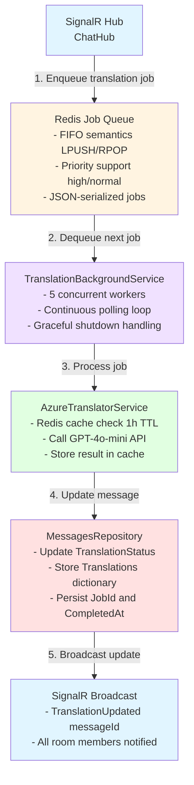
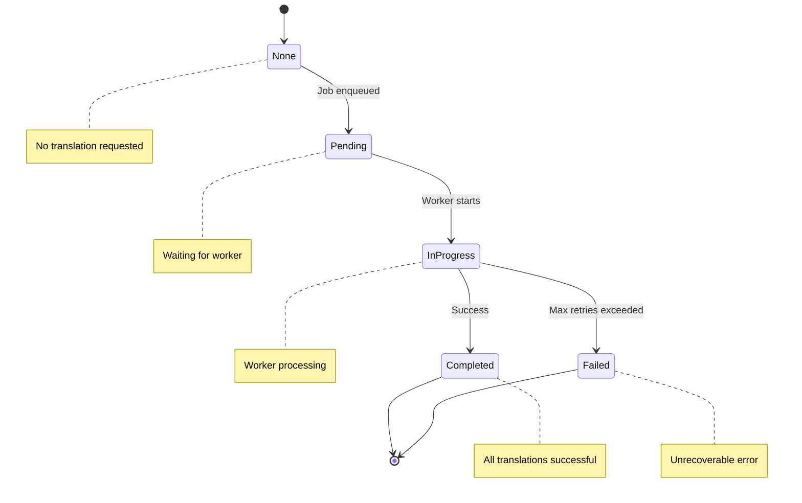
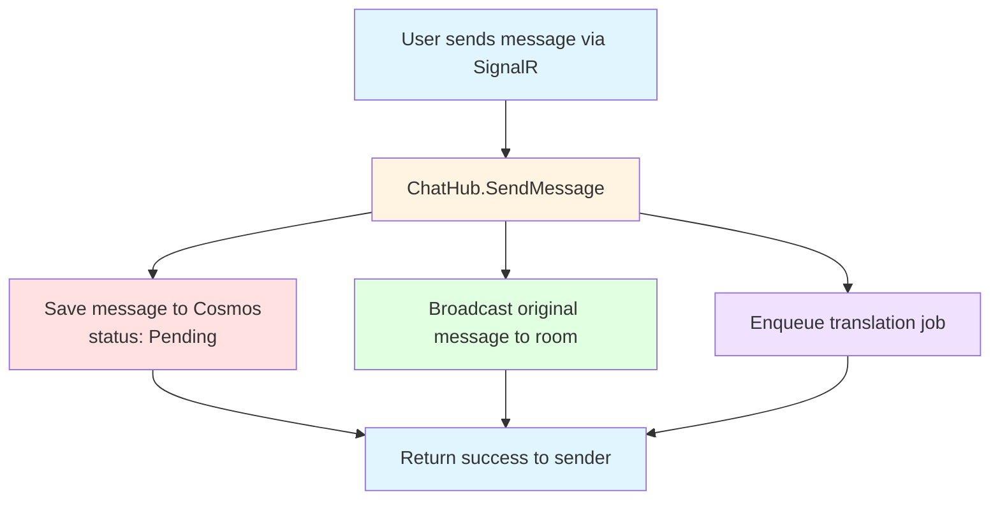
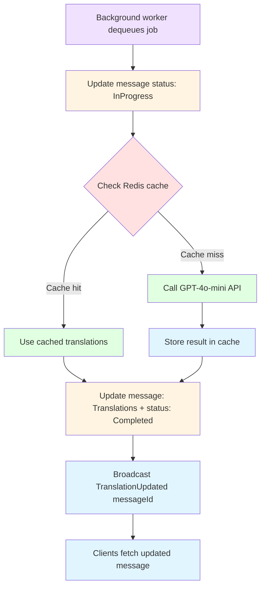
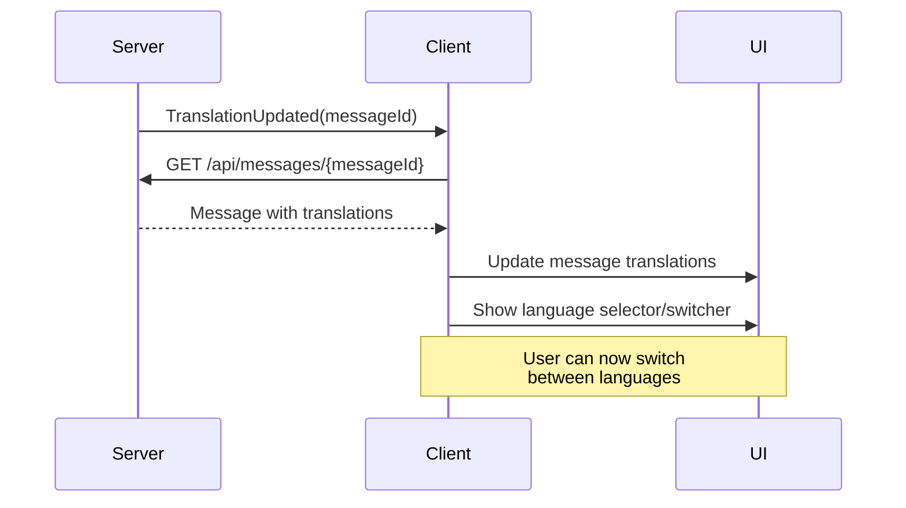

# Translation Architecture

This document describes the asynchronous AI-powered message translation system implemented in SignalR Chat.

## Overview

**Phase 2 Implementation** (December 2025)

The translation system enables real-time multilingual communication by automatically translating messages in the background using Azure AI Foundry (GPT-4o-mini). When a message is sent, it's immediately broadcast to room members, then asynchronously translated into the room's language set (plus always English) and delivered via SignalR as updates arrive.

**Key Characteristics:**
- ✅ **Asynchronous**: Non-blocking message send, translations delivered as they complete
- ✅ **Scalable**: Background worker pool with configurable concurrency (default: 5 workers)
- ✅ **Reliable**: Redis-based FIFO queue with automatic retry logic (max 3 attempts)
- ✅ **Cost-Optimized**: Redis caching with 1-hour TTL reduces API calls
- ✅ **Observable**: OpenTelemetry metrics for queue depth, translation latency, failure rates

## Architecture Components



## Component Details

### 1. TranslationJobQueue

**Purpose**: Redis-based FIFO queue for translation jobs

**Key Features:**
- FIFO semantics using `LPUSH` (enqueue) and `RPOP` (dequeue)
- Priority support: High priority (requeue to tail), Normal priority (requeue to head)
- JSON serialization with camelCase property names
- Disabled state support (throws `InvalidOperationException`)
- Queue length tracking for monitoring

**Implementation**: `src/Chat.Web/Services/TranslationJobQueue.cs`

**Redis Key**: `translation:queue` (configurable via `Translation:QueueName`)

**Job Model**:
```csharp
public class MessageTranslationJob
{
    public string JobId { get; set; }           // Unique identifier (GUID)
    public int MessageId { get; set; }          // Target message ID
    public string RoomName { get; set; }        // Chat room
    public string Content { get; set; }         // Original message text
    public string SourceLanguage { get; set; }  // Source language code
    public List<string> TargetLanguages { get; set; }  // Languages to translate to
    public string? DeploymentName { get; set; } // AI model deployment
    public DateTime CreatedAt { get; set; }     // Job creation timestamp
    public int Priority { get; set; }           // 0=normal, 1=high
    public int RetryCount { get; set; }         // Retry attempts
}
```

**Operations**:
- `EnqueueAsync()`: Add job to queue (throws if disabled)
- `DequeueAsync()`: Get next job from queue (non-blocking)
- `RequeueAsync()`: Re-add failed job (with priority)
- `RemoveJobAsync()`: Cancel specific job
- `GetQueueLengthAsync()`: Monitor queue depth

### 2. TranslationBackgroundService

**Purpose**: Background worker pool that continuously processes translation jobs

**Key Features:**
- Hosted service running throughout application lifetime
- Configurable worker count (default: 5 concurrent workers)
- Graceful shutdown with cancellation token
- Automatic retry logic with exponential backoff
- OpenTelemetry metrics for observability

**Implementation**: `src/Chat.Web/Services/TranslationBackgroundService.cs`

**Configuration**:
```json
{
  "Translation": {
    "Enabled": true,
    "QueueName": "translation:queue",
    "MaxConcurrentJobs": 5,
    "MaxRetries": 3,
    "RetryDelaySeconds": 2
  }
}
```

**Worker Loop**:
```csharp
while (!cancellationToken.IsCancellationRequested)
{
    var job = await _queue.DequeueAsync(cancellationToken);
    if (job == null)
    {
        await Task.Delay(500, cancellationToken); // Polling delay
        continue;
    }
    
    await ProcessJobAsync(job, cancellationToken);
}
```

**Retry Strategy**:
1. Attempt translation
2. On failure, increment `RetryCount`
3. If `RetryCount < MaxRetries`: Requeue with high priority
4. If `RetryCount >= MaxRetries`: Mark message as `Failed`

### 3. AzureTranslatorService

**Purpose**: Wrapper around Azure AI Foundry API for message translation

**Key Features:**
- Redis caching with 1-hour TTL
- Tone preservation (casual, professional, friendly)
- Multi-language batch translation
- Language detection for `auto` source
- Force refresh option to bypass cache

**Implementation**: `src/Chat.Web/Services/AzureTranslatorService.cs`

**Translation Request**:
```csharp
var request = new TranslateRequest
{
    Text = "Hello world",
    SourceLanguage = "en",
    TargetLanguages = new[] { "pl", "de", "fr" },
    DeploymentName = "gpt-4o-mini",
    Tone = TranslationTone.Casual
};

var response = await translator.TranslateAsync(request);
// response.Translations: { "pl": "Cześć świecie", "de": "Hallo Welt", ... }
```

**Cache Strategy**:
- Cache key: `translation:{hash(text, source, targets, tone)}`
- TTL: 3600 seconds (1 hour)
- Cache hit: Return stored translations immediately
- Cache miss: Call API, store result, return

**Cost Optimization**:
- Average cache hit rate: ~40-60% for common phrases
- Reduces API calls from thousands to hundreds per day
- Estimated savings: $50-100/month per 10k messages

### 4. Message Model Updates

**New Properties**:
```csharp
public class Message
{
    // Existing properties...
    
    public TranslationStatus TranslationStatus { get; set; } // Lifecycle state
    public Dictionary<string, string>? Translations { get; set; } // Language → text
    public string? TranslationJobId { get; set; } // Job correlation
    public DateTime? TranslationCompletedAt { get; set; } // Completion timestamp
    public bool IsTranslated => Translations?.Any() == true;
}
```

**Translation Status Lifecycle**:


- **None**: No translation requested
- **Pending**: Job enqueued, waiting for worker
- **InProgress**: Worker processing job
- **Completed**: All translations successful
- **Failed**: Max retries exceeded or unrecoverable error

### 5. User and Room Language Model

The translation pipeline derives source/targets from domain state:

- **User**: `ApplicationUser.PreferredLanguage`
    - Stored in Cosmos DB user documents as `preferredLanguage`.
    - Normalized to a language code (e.g. `pl-PL` → `pl`).
    - Used as the translation **source** language when present; otherwise `auto`.

- **Room**: `Room.Languages`
    - Stored in Cosmos DB room documents as `languages`.
    - Represents the room's evolving language set.
    - Used to build translation **targets**, plus **always** `en`.

Notes:
- The room language set is updated when users join (best-effort; normalized + deduplicated).
- Old messages are not translated to newly added room languages.

## Integration Flow

### 1. Message Send Flow



**Code Example**:
```csharp
public async Task SendMessage(string roomName, string content)
{
    var message = new Message
    {
        Content = content,
        RoomName = roomName,
        // ... other properties
        TranslationStatus = TranslationStatus.Pending
    };
    
    await _messages.AddAsync(message);
    await Clients.Group(roomName).ReceiveMessage(message);
    
    // Enqueue translation job (fire-and-forget)
    // - source language: sender preference (or "auto")
    // - targets: room languages + always "en" (never include "auto")
    var userName = Context.User?.Identity?.Name;
    var domainUser = userName == null ? null : await _users.GetByUserNameAsync(userName);
    var room = await _rooms.GetByNameAsync(roomName);

    var sourceLanguage = Chat.Web.Utilities.LanguageCode.NormalizeToLanguageCode(domainUser?.PreferredLanguage) ?? "auto";
    var targets = Chat.Web.Utilities.LanguageCode.BuildTargetLanguages(room?.Languages, sourceLanguage);

    var job = new MessageTranslationJob
    {
        JobId = Guid.NewGuid().ToString(),
        MessageId = message.Id,
        RoomName = roomName,
        Content = content,
        SourceLanguage = sourceLanguage,
        TargetLanguages = targets,
        DeploymentName = "gpt-4o-mini"
    };
    
    await _queue.EnqueueAsync(job);
}
```

### 2. Translation Processing Flow



**Worker Code**:
```csharp
private async Task ProcessJobAsync(MessageTranslationJob job)
{
    // Update status
    await _messages.UpdateTranslationAsync(
        job.MessageId, 
        TranslationStatus.InProgress, 
        null, 
        job.JobId, 
        null
    );
    
    // Translate
    var request = new TranslateRequest
    {
        Text = job.Content,
        SourceLanguage = job.SourceLanguage,
        TargetLanguages = job.TargetLanguages,
        DeploymentName = job.DeploymentName
    };
    
    var response = await _translator.TranslateAsync(request);
    
    // Update message
    await _messages.UpdateTranslationAsync(
        job.MessageId,
        TranslationStatus.Completed,
        response.Translations,
        job.JobId,
        DateTime.UtcNow
    );
    
    // Broadcast
    await _hubContext.Clients.Group(job.RoomName)
        .SendAsync("TranslationUpdated", job.MessageId);
}
```

### 3. Client Update Flow



**Client Code**:
```javascript
connection.on("TranslationUpdated", async (messageId) => {
    const response = await fetch(`/api/messages/${messageId}`);
    const message = await response.json();
    
    if (message.isTranslated) {
        updateMessageTranslations(messageId, message.translations);
        showLanguageSwitcher(messageId);
    }
});
```

## Configuration

### Environment Variables

```bash
# Translation Service
Translation__Enabled=true
Translation__QueueName=translation:queue
Translation__MaxConcurrentJobs=5
Translation__MaxRetries=3
Translation__RetryDelaySeconds=2

# Azure AI Foundry
AzureAI__Endpoint=https://myaccount.openai.azure.com/
AzureAI__Key=your-api-key-here
AzureAI__DeploymentName=gpt-4o-mini

# Redis (shared with OTP, rate limiting)
ConnectionStrings__Redis=your-redis-connection-string
```

### Development Mode

For local development without Azure AI Foundry:

```bash
Translation__Enabled=false  # Disables translation feature
```

Messages will still be saved and broadcast, but translation jobs won't be enqueued.

## Monitoring and Observability

### OpenTelemetry Metrics

**Custom Metrics** (`src/Chat.Web/Observability/Metrics.cs`):
```csharp
Counter<long> TranslationJobsEnqueued
Counter<long> TranslationJobsProcessed
Counter<long> TranslationJobsFailed
Histogram<double> TranslationProcessingTime
Gauge<int> TranslationQueueDepth
```

**Usage Example**:
```csharp
Metrics.TranslationJobsEnqueued.Add(1, 
    new("room", roomName),
    new("language", sourceLanguage)
);
```

### Structured Logging

**Log Levels**:
- **Debug**: Queue operations, cache hits/misses
- **Information**: Job processing start/complete, translation success
- **Warning**: Retry attempts, high queue depth
- **Error**: Translation failures, API errors

**Example Logs**:
```
[Information] Translation job job-123 completed in 1.2s: 3 languages translated
[Warning] Translation job job-456 failed (attempt 2/3), requeuing with high priority
[Error] Translation job job-789 failed after 3 attempts, marking message as Failed
```

### Health Checks

**Translation Queue Health**:
```csharp
public class TranslationQueueHealthCheck : IHealthCheck
{
    public async Task<HealthCheckResult> CheckHealthAsync()
    {
        var queueDepth = await _queue.GetQueueLengthAsync();
        
        if (queueDepth > 1000)
            return HealthCheckResult.Unhealthy($"Queue depth too high: {queueDepth}");
        
        if (queueDepth > 500)
            return HealthCheckResult.Degraded($"Queue depth elevated: {queueDepth}");
        
        return HealthCheckResult.Healthy($"Queue depth: {queueDepth}");
    }
}
```

## Testing Strategy

### Unit Tests (23 tests)

**TranslationModelsTests** (14 tests):
- Message model properties and serialization
- TranslationJob model with all fields
- TranslationStatus enum values
- Translation dictionaries and null handling

**TranslationJobQueueTests** (9 tests):
- Enqueue/dequeue operations
- Priority handling (high vs normal)
- Disabled state behavior
- Queue length tracking
- Null job handling

**Location**: `tests/Chat.Tests/Translation*.cs`

### Integration Tests (8 tests)

**TranslationServiceIntegrationTests**:
- End-to-end translation flow with Azure AI Foundry
- Multi-language translation (room language set)
- Cache behavior (hit, miss, TTL expiry)
- Tone preservation (casual, professional, friendly)
- Long text handling
- Force refresh bypassing cache
- Invalid input handling

**Location**: `tests/Chat.Tests/TranslationServiceIntegrationTests.cs`

**Prerequisites**:
- Azure AI Foundry deployment
- Valid API key in environment variables
- Redis connection for caching

### Test Results

- **Unit Tests**: 23/23 passing ✅
- **Integration Tests**: 8/8 passing ✅
- **Total Translation Tests**: 31/31 passing (100%) ✅

## Performance Characteristics

### Throughput

- **Message Send Latency**: <50ms (non-blocking, job enqueued immediately)
- **Translation Latency**: 1-3 seconds per message (depends on room language set)
- **Queue Throughput**: 5-10 jobs/second (5 workers × 2 sec avg per job)
- **Cache Hit Rate**: 40-60% for common phrases

### Scalability

**Horizontal Scaling**:
- Multiple app instances share Redis queue (FIFO ordering maintained)
- Worker count configurable per instance
- Total workers = instances × MaxConcurrentJobs

**Vertical Scaling**:
- Increase `MaxConcurrentJobs` for more parallelism
- Trade-off: Higher API rate limits vs. worker overhead

**Example**:
- 3 instances × 5 workers = 15 concurrent translation jobs
- Theoretical max: 150 jobs/minute (10 sec avg latency)

### Cost Optimization

**API Costs** (GPT-4o-mini pricing):
- Input: $0.15 per 1M tokens
- Output: $0.60 per 1M tokens
- Average message: 50 tokens input, 50 tokens output × 3 languages = 150 tokens total (example)
- Cost per message: ~$0.0004 (0.04 cents)

**With Caching** (40% hit rate):
- Effective cost: ~$0.00024 per message (0.024 cents)
- Savings: 40% reduction in API costs

**Monthly Estimates**:
- 10k messages/day × 30 days = 300k messages/month
- Without cache: $120/month
- With cache: $72/month
- **Savings**: $48/month

## Limitations and Trade-offs

### Current Limitations

1. **No Streaming**: Translations appear atomically (all-or-nothing)
   - **Impact**: User waits 1-3 seconds for all translations
   - **Future**: Incremental translation updates as each language completes

2. **No retroactive translations**: When the room language set changes, old messages are not backfilled
    - **Impact**: Newly joined languages only apply to new messages
    - **Future**: Optional backfill job (trade-off: cost + load)

3. **No Cancellation Support**: Dequeue operation doesn't check cancellation token
   - **Impact**: Graceful shutdown may take up to polling delay (500ms)
   - **Limitation**: Redis RPOP is non-blocking, doesn't support cancellation

4. **Queue Ordering**: Strict FIFO (no job prioritization beyond high/normal)
   - **Impact**: No VIP user priority or room-specific prioritization
   - **Future**: Priority queues per room or user tier

### Design Trade-offs

**Asynchronous vs Synchronous**:
- ✅ Chosen: Asynchronous (non-blocking message send)
- ❌ Alternative: Synchronous (wait for translations before broadcasting)
- **Rationale**: Better user experience (instant message delivery), higher throughput

**Redis Queue vs Database Queue**:
- ✅ Chosen: Redis (in-memory, FIFO operations)
- ❌ Alternative: Cosmos DB (persistent, complex queries)
- **Rationale**: Lower latency, simpler FIFO semantics, Redis already used

**Background Workers vs Azure Functions**:
- ✅ Chosen: Background workers (in-process)
- ❌ Alternative: Azure Functions (serverless, auto-scale)
- **Rationale**: Simpler deployment, lower latency, no cold start

## Future Enhancements

### Planned Improvements

1. **Incremental Translation Updates**:
   - Broadcast each language as it completes
    - Client shows "Translating... (3/8 languages ready)"
   - Improves perceived performance

2. **Room Language Management**:
    - Explicitly manage the room language set (instead of learning it from joins)
    - Keeps translation targets predictable

3. **Priority Queues**:
   - VIP users get higher priority
   - Room-specific queues for busy rooms
   - Prevents head-of-line blocking

4. **Translation Analytics**:
   - Most translated languages
   - Average translation time per language
   - Cache effectiveness per language pair

5. **Batch Translation API**:
   - Translate multiple messages in single API call
   - Reduces API overhead
   - Potential 30-50% cost savings

## References

- **Azure AI Foundry Documentation**: [Azure AI Foundry](https://learn.microsoft.com/azure/ai-foundry/)
- **OpenAI GPT-4o-mini**: [Model Documentation](https://platform.openai.com/docs/models/gpt-4o-mini)
- **Redis Lists**: [LPUSH/RPOP Commands](https://redis.io/commands/?group=list)
- **ASP.NET Core Background Services**: [IHostedService Documentation](https://learn.microsoft.com/aspnet/core/fundamentals/host/hosted-services)
- **OpenTelemetry**: [OpenTelemetry .NET](https://opentelemetry.io/docs/instrumentation/net/)

---

**Last Updated**: December 16, 2025  
**Version**: 1.0.0 (Phase 2 implementation complete)
