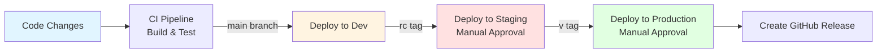

# Deployment

Deploy SignalR Chat to Azure using Infrastructure as Code (Bicep) and CI/CD pipelines.

## Deployment Options

### Azure Deployment (Recommended)
- **[Bootstrap Guide](bootstrap.md)** - Complete deployment from scratch
- **[Azure Deployment Guide](azure/)** - Azure infrastructure documentation
  - **[Bicep Templates](azure/bicep-templates.md)** - Infrastructure as Code details
- **[GitHub Actions CI/CD](github-actions.md)** - Automated deployment pipelines

### Pre-Deployment
- **[Production Checklist](production-checklist.md)** - Essential steps before go-live
- **[Windows to Linux Migration](windows-to-linux-migration.md)** - Platform migration guide


## GitHub Actions: Required Variables & Secrets

Before deploying, ensure you have set up all required GitHub environment variables and secrets for your environment:

- [GitHub Variables Guide](github-variables.md) — Resource naming, region, and network configuration
- [GitHub Secrets Guide](github-secrets.md) — All sensitive values (connection strings, Entra ID, OTP pepper)

These must be configured in GitHub → Settings → Environments → [dev/staging/prod] for each environment. See guides above for details and examples.

---

## Quick Start

### Prerequisites
- Azure subscription with contributor access
- Azure CLI installed
- GitHub repository (for CI/CD)

### Deploy to Dev Environment

```bash
# Navigate to Bicep templates
cd infra/bicep

# Deploy infrastructure
az deployment sub create \
  --location polandcentral \
  --template-file main.bicep \
  --parameters main.parameters.dev.bicepparam
```

➡️ **Full guide**: [Azure Deployment](azure/)

## Deployment Flow



## Environments

| Environment | Trigger | Approval | Purpose |
|-------------|---------|----------|---------|
| **Dev** | Push to `main` | ❌ Auto | Development testing |
| **Staging** | Tag `rc*` | ✅ Manual | Pre-production validation |
| **Production** | Tag `v*.*.*` | ✅ Manual | Live environment |

## Infrastructure Components

### Azure Resources
- **App Service (Linux)** - Web application hosting (.NET 9.0)
- **Cosmos DB** - NoSQL database
- **Redis** - Cache and OTP storage
- **SignalR Service** - Real-time scale-out (optional)
- **Communication Services** - Email/SMS (optional)
- **Application Insights** - Monitoring
- **VNet + Private Endpoints** - Network security

### Cost Estimates

| Environment | Monthly Cost (USD) | Details |
|-------------|-------------------|---------|
| **Dev** | ~$150-250 | P0V4, Serverless Cosmos, B1 Redis |
| **Staging** | ~$400-600 | P0V4, Standard Cosmos 1000 RU/s, B3 Redis |
| **Production** | ~$1200-1800 | P0V4, Standard Cosmos 4000 RU/s, B5 Redis |

## Documentation

- [Bootstrap Guide](bootstrap.md) - Complete deployment from scratch
- [Azure Deployment Guide](azure/) - Bicep templates and infrastructure
- [GitHub Actions](github-actions.md) - CI/CD pipeline configuration
- [Environments](environments.md) - Environment-specific settings
- [Production Checklist](production-checklist.md) - Pre-launch verification
- [Troubleshooting](troubleshooting.md) - Common issues and solutions

## Next Steps

1. Review [Production Checklist](production-checklist.md)
2. Deploy to [Dev environment](azure/)
3. Set up [CI/CD pipelines](github-actions.md)
4. Configure [monitoring](../operations/monitoring.md)

[Back to documentation home](../README.md)
