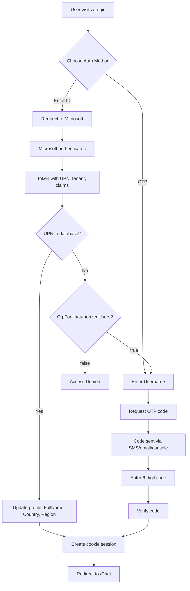

# Authentication

SignalR Chat supports **dual authentication modes**:
- **Microsoft Entra ID (Azure AD)** - Enterprise single sign-on for organizational users
- **OTP (One-Time Password)** - Fallback authentication for guest users or when Entra ID is unavailable

Both methods use cookie-based authentication for session management.

---

## Table of Contents

1. [Authentication Overview](#1-authentication-overview)
2. [Microsoft Entra ID Authentication](#2-microsoft-entra-id-authentication)
3. [OTP Authentication (Fallback)](#3-otp-authentication-fallback)
4. [Implementation Details](#4-implementation-details)
5. [Configuration](#5-configuration)
6. [Testing](#6-testing)

---

## 1. Authentication Overview

### Supported Methods

| Method | Use Case | User Experience | Security Features |
|--------|----------|-----------------|-------------------|
| **Entra ID** | Enterprise users | SSO (single sign-on), no OTP codes | OAuth 2.0/OIDC, tenant validation, UPN-based authorization |
| **OTP** | Guest users, fallback | 6-digit code via SMS/email/console | Argon2id hashing, rate limiting, pepper |

### Login Flow



---

## 2. Microsoft Entra ID Authentication

### Overview

Enterprise users authenticate via **OpenID Connect** (OIDC) with Microsoft Entra ID (formerly Azure Active Directory).

**Key Features:**
- **Multi-Tenant Support**: Users from any Entra ID tenant can authenticate
- **Tenant Validation**: `AllowedTenants` list restricts access to specific organizations
- **UPN-Based Authorization**: Strict User Principal Name (UPN) matching (e.g., `alice@contoso.com`)
- **No Auto-Provisioning**: Admin must pre-populate UPN in database before first login
- **Profile Sync**: FullName, Country, Region automatically updated from token claims
- **Automatic Silent SSO (Optional)**: One-time background attempt using `prompt=none` for frictionless entry

### Automatic Silent SSO (Optional)

If enabled, the application performs a **single silent SSO attempt** (OIDC `prompt=none`) on the first unauthenticated visit to `/` or any `/chat` path.

**Behavior:**
- Middleware sets a short-lived cookie (default: `sso_attempted`) to prevent repeated attempts or loops.
- If the browser already holds an active Microsoft session, authentication succeeds transparently and the user is redirected to the originally requested page.
- If user interaction is required (`interaction_required`, no session, or blocked pop-ups), the silent attempt fails and the user is redirected to `/login?reason=sso_failed`.
- If Entra ID login succeeds but the UPN is **not authorized** (missing in database), redirect: `/login?reason=not_authorized`.
- If OTP fallback is allowed (`Fallback:OtpForUnauthorizedUsers: true`), the login page shows a warning allowing OTP sign-in; otherwise a denial message is shown.

**Query Parameters Used:**
| Parameter | Meaning | UI Outcome |
|-----------|---------|------------|
| `reason=sso_failed` | Silent SSO could not complete (interaction needed) | Info alert: choose method |
| `reason=not_authorized` | UPN not found / not permitted | Warning (OTP allowed) or Error (OTP disabled) |
| `error=authentication_failed` | General OIDC auth failure | Error alert |

**Configuration Block:**
```jsonc
{
  "EntraId": {
    // ... existing settings ...
    "AutomaticSso": {
      "Enable": true,                 // Master switch
      "AttemptOncePerSession": true,  // Guard against loops
      "AttemptCookieName": "sso_attempted" // Customizable cookie name
    }
  }
}
```

**Implementation Components:**
- `SilentSsoMiddleware`: Performs guarded silent challenge, sets `props.Items["silent"] = "true"` to persist state through OAuth callback.
- OIDC Events:
  - `OnRedirectToIdentityProvider`: Injects `prompt=none` when silent flag present (checks both `Parameters` and `Items` collections).
  - `OnRemoteFailure`: Detects silent failure; redirects with `reason=sso_failed`. Checks both `Parameters` and `Items` for silent flag.
  - `OnTokenValidated`: Enforces strict UPN authorization; redirects with `reason=not_authorized` if user missing.

**State Persistence:**
- Silent flag must be set in **both** `Parameters` (for state parameter) **and** `Items` (to survive OAuth redirect cycle).
- `Items["silent"]` persists through the OAuth callback, while `Parameters["silent"]` may be lost.
- Event handlers check both collections to reliably detect silent authentication attempts.

**Operational Notes:**
- Silent attempt only triggers for GET requests to `/`, `/chat`, or child paths.
- Cookie lifetime (10 minutes) balances session freshness and loop prevention.
- Path exclusions prevent loops: `/login`, `/signin`, `/signout` are never challenged.
- Response.HasStarted checks before redirects prevent "headers already sent" exceptions.
- Safe to disable via `AutomaticSso:Enable=false` without code changes.

### Configuration

See **[Entra ID Multi-Tenant Setup Guide](../development/entra-id-multi-tenant-setup.md)** for complete configuration steps.

**Quick Setup** (`appsettings.json`):
```json
{
  "EntraId": {
    "Instance": "https://login.microsoftonline.com/",
    "TenantId": "organizations",
    "ClientId": "<your-client-id>",
    "ClientSecret": "<your-client-secret>",
    "CallbackPath": "/signin-oidc",
    "Authorization": {
      "AllowedTenants": [
        "12345678-1234-1234-1234-123456789012"
      ],
      "RequireTenantValidation": true
    },
    "Fallback": {
      "EnableOtp": true,
      "OtpForUnauthorizedUsers": true
    }
    "AutomaticSso": {
      "Enable": true,
      "AttemptOncePerSession": true,
      "AttemptCookieName": "sso_attempted"
    }
  }
}
```

### Token Claims Used

| Claim | Purpose | Example | Field Updated |
|-------|---------|---------|---------------|
| `preferred_username` | User Principal Name (UPN) | `alice@contoso.com` | `Upn` |
| `tid` | Tenant ID | `12345678-1234-1234-1234-123456789012` | `TenantId` |
| `name` | Display name | `Alice Smith` | `DisplayName`, `FullName` |
| `email` | Email address | `alice@contoso.com` | `Email` |
| `country` | Country code (ISO 3166-1 alpha-2) | `US` | `Country` |
| `state` | State/region | `California` | `Region` |

### User Pre-Population (Required)

Admin must set UPN before user's first Entra ID login:

**Azure Portal (Cosmos DB Data Explorer)**:
```sql
UPDATE c
SET c.upn = "alice@contoso.com"
WHERE c.id = "alice"
```

**Programmatic (C#)**:
```csharp
var user = await usersRepo.GetByUserName("alice");
user.Upn = "alice@contoso.com";
await usersRepo.Upsert(user);
```

### Security Model

1. **Token Validation**: Signature, issuer, audience, expiration
2. **Tenant Validation**: `tid` claim must be in `AllowedTenants` list
3. **UPN Lookup**: Case-insensitive query: `LOWER(c.upn) = LOWER('alice@contoso.com')`
4. **Authorization**: If UPN not found → Deny access (or redirect to OTP if `OtpForUnauthorizedUsers: true`)
5. **Profile Update**: FullName, Country, Region updated from token claims

---

## 3. OTP Authentication (Fallback)

### Overview

Guest users or users without Entra ID access can authenticate using **One-Time Password (OTP)** codes.

**Key Features:**
- **6-digit codes**: Sent via SMS, email, or console (local development)
- **Argon2id hashing**: Memory-hard, pepper + salt protection
- **Rate limiting**: 5 attempts per 15 minutes per user
- **TTL**: Codes expire after 5 minutes
- **Constant-time verification**: Prevents timing attacks

### OTP Flow

1. **Request**: User enters username → POST `/api/auth/start`
2. **Code Generation**: Random 6-digit code (100000-999999)
3. **Hashing**: `Argon2id(pepper || userName || salt || code)`
4. **Storage**: Redis `otp:{user}` → `OtpHash:v2:argon2id:m=65536,t=4,p=4:{saltB64}:{hashB64}` (TTL: 300s)
5. **Delivery**: SMS/Email via Azure Communication Services (or console in dev)
6. **Verification**: User enters code → POST `/api/auth/verify` → Argon2.Verify() with constant-time comparison

### Threat Model

**What we're protecting against:**
- Offline disclosure if Redis dump/memory snapshot is exfiltrated
- Log leakage (accidental plaintext OTP logging)
- Insider read access to Redis contents
- Online brute force attacks

**What we cannot fully prevent:**
- Online brute force via verification API (mitigated by rate limiting)
- Exhaustive offline brute force of 6-digit code (~1,000,000 possibilities) if hash function is fast and unkeyed

**Security Measures:**
1. ✅ **Argon2id hashing**: Memory-hard KDF (64 MB, 4 iterations, 4 threads)
2. ✅ **Pepper**: Server-side secret (`Otp__Pepper` environment variable)
3. ✅ **Random salt**: 16 bytes per OTP
4. ✅ **Rate limiting**: Max 5 verification attempts per 15 minutes
5. ✅ **Constant-time comparison**: `Argon2.Verify()` built-in protection
6. ✅ **No plaintext logging**: Codes never appear in logs

---

## 4. Implementation Details

### Argon2id Configuration

**Hash Format**: `OtpHash:v2:argon2id:m=65536,t=4,p=4:{saltB64}:{hashB64}`

**Parameters**:
- **Memory**: 64 MB (65536 KB)
- **Iterations**: 4
- **Parallelism**: 4 threads
- **Output**: 32 bytes
- **Pepper**: Environment variable `Otp__Pepper` (Base64, 32+ bytes)
- **Salt**: Random 16 bytes per OTP

**Implementation** (`Argon2OtpHasher.cs`):
```csharp
public string Hash(string userName, string code)
{
    // Generate random 16-byte salt
    byte[] salt = RandomNumberGenerator.GetBytes(16);
    
    // Combine: pepper || userName || salt || code
    string input = $"{_pepper}{userName}{Convert.ToBase64String(salt)}{code}";
    byte[] inputBytes = Encoding.UTF8.GetBytes(input);
    
    // Hash with Argon2id
    var config = new Argon2Config
    {
        Type = Argon2Type.DataIndependentAddressing,
        Version = Argon2Version.Nineteen,
        MemoryCost = 65536,  // 64 MB
        TimeCost = 4,
        Lanes = 4,
        Threads = 4,
        HashLength = 32,
        Salt = salt,
        Password = inputBytes
    };
    
    using var argon2 = new Argon2(config);
    using var hash = argon2.Hash();
    
    return $"OtpHash:v2:argon2id:m=65536,t=4,p=4:{Convert.ToBase64String(salt)}:{Convert.ToBase64String(hash.Buffer)}";
}
```

**Verification** (constant-time):
```csharp
public bool Verify(string userName, string code, string storedHash)
{
    // Parse: OtpHash:v2:argon2id:m=65536,t=4,p=4:{saltB64}:{hashB64}
    var parts = storedHash.Split(':');
    byte[] salt = Convert.FromBase64String(parts[5]);
    byte[] expectedHash = Convert.FromBase64String(parts[6]);
    
    // Reconstruct input
    string input = $"{_pepper}{userName}{Convert.ToBase64String(salt)}{code}";
    
    // Verify with constant-time comparison
    return Argon2.Verify(expectedHash, Encoding.UTF8.GetBytes(input), config);
}
```

### Rate Limiting

**Implementation**: Redis-backed counter `otp_attempts:{user}`

**Flow**:
1. **Attempt Check**: `INCR otp_attempts:{user}` (atomic increment)
2. **TTL Sync**: Set expiry to match OTP lifetime (300 seconds)
3. **Threshold**: If count > 5 → Return 429 Too Many Requests
4. **Reset**: Counter auto-expires after 15 minutes
5. **Metrics**: `chat.otp.verifications.ratelimited` counter incremented

**Fail-Open Behavior**: On Redis errors, allow verification (log error, don't block users)

### OTP Delivery

**Azure Communication Services** (Production):
- **SMS**: Via ACS SMS endpoint
- **Email**: Via ACS Email endpoint

**Console Output** (Development):
```
=== OTP CODE FOR USER: alice ===
CODE: 123456
=================================
```

**Code Generation** (cryptographically secure):
```csharp
// ✅ CORRECT (Issue #62)
int code = RandomNumberGenerator.GetInt32(100000, 1000000);

// ❌ WRONG (predictable)
// int code = new Random().Next(100000, 1000000);
```

---

## 5. Configuration

### Entra ID Settings

**Environment Variables** (`.env.local`):
```bash
EntraId__ClientId=<your-client-id>
EntraId__ClientSecret=<your-client-secret>
EntraId__Authorization__AllowedTenants__0=<tenant-id-1>
EntraId__Authorization__AllowedTenants__1=<tenant-id-2>
```

**appsettings.json**:
```json
{
  "EntraId": {
    "Instance": "https://login.microsoftonline.com/",
    "TenantId": "organizations",
    "ClientId": "",
    "ClientSecret": "",
    "CallbackPath": "/signin-oidc",
    "SignedOutCallbackPath": "/signout-callback-oidc",
    "Authorization": {
      "AllowedTenants": [],
      "RequireTenantValidation": true
    },
    "Fallback": {
      "EnableOtp": true,
      "OtpForUnauthorizedUsers": true
    }
  }
}
```

### OTP Settings

**Environment Variables** (`.env.local`):
```bash
Otp__Pepper=<Base64-encoded-32-byte-secret>
Otp__MaxAttempts=5
Otp__CodeLifetimeSeconds=300
Acs__ConnectionString=endpoint=https://...
Acs__EmailFrom=noreply@example.com
Redis__ConnectionString=redis-signalrchat.redis.cache.windows.net:6380,password=...
```

**appsettings.json**:
```json
{
  "Otp": {
    "MaxAttempts": 5,
    "LockoutMinutes": 15,
    "CodeLifetimeSeconds": 300,
    "AllowPlaintext": false
  },
  "Acs": {
    "EmailFrom": "noreply@example.com"
  }
}
```

### Security Checklist

| Feature | Status | Verification |
|---------|--------|--------------|
| Entra ID configured | ✅ Required | Verify `EntraId__ClientId` env var |
| AllowedTenants set | ✅ Required | Check `AllowedTenants` array not empty |
| Argon2id hashing | ✅ Implemented | Check `OtpHash:v2:argon2id:...` format in Redis |
| Pepper configured | ✅ Required | Verify `Otp__Pepper` env var (32+ bytes) |
| Random salt | ✅ Implemented | Check hash format includes `{saltB64}` |
| Constant-time verify | ✅ Built-in | `Argon2.Verify()` method |
| Rate limiting | ✅ Implemented | Test 6 failed attempts → 429 response |
| Secure RNG | ⚠️ **VERIFY** | **Issue #62** - Check `RandomNumberGenerator.GetInt32()` |
| No plaintext logging | ✅ Implemented | Search logs for "OTP", "code", digits |

---

## 6. Testing

### Unit Tests

**OTP Hashing** (`Chat.Tests/OtpHasherTests.cs`):
```bash
dotnet test tests/Chat.Tests/ --filter "OtpHasher"
```

**User Repositories** (`Chat.Tests/CosmosRepositoriesTests.cs`):
```bash
dotnet test tests/Chat.Tests/ --filter "CosmosRepositories"
```

### Integration Tests

**OTP Auth Flow** (`Chat.IntegrationTests/OtpAuthFlowTests.cs`):
```bash
dotnet test tests/Chat.IntegrationTests/ --filter "OtpAuthFlow"
```

**Rate Limiting** (`Chat.IntegrationTests/OtpAttemptLimitingTests.cs`):
```bash
dotnet test tests/Chat.IntegrationTests/ --filter "OtpAttemptLimiting"
```

**Entra ID Auth** (Manual Testing Required):
1. Configure Entra ID app registration
2. Set `AllowedTenants` to your tenant ID
3. Add UPN to database: `UPDATE c SET c.upn = "alice@contoso.com" WHERE c.id = "alice"`
4. Visit `/Login` → Click "Sign in with Microsoft"
5. Verify redirect to Entra ID, token exchange, profile update
6. Check database: `country`, `region`, `displayName` fields populated

### Security Testing

**Rate Limiting Verification**:
```bash
# Attempt 6 OTP verifications (should rate limit on 6th)
for i in {1..6}; do
  curl -X POST https://localhost:5099/api/auth/verify \
    -H "Content-Type: application/json" \
    -d '{"username":"alice","code":"000000"}'
done
# Expected: First 5 return 401 Unauthorized, 6th returns 429 Too Many Requests
```

**Argon2id Verification**:
```bash
# Check Redis for hashed OTP format
redis-cli -h <redis-host> -p 6380 -a <password> GET "otp:alice"
# Expected output: OtpHash:v2:argon2id:m=65536,t=4,p=4:BASE64SALT:BASE64HASH
```

---

## Related Documentation

- **[Entra ID Multi-Tenant Setup Guide](../development/entra-id-multi-tenant-setup.md)** - Complete configuration steps
- **[Sessions & Cookies](sessions.md)** - Cookie-based session management
- **[Security Features](../reference/security.md)** - Comprehensive security overview

---

**Last Updated**: 2025-01-15  
**Version**: 0.9.5
