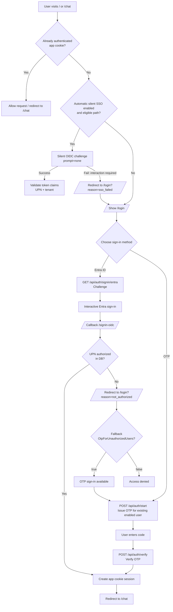

# Authentication

SignalR Chat supports **dual authentication modes**:
- **Microsoft Entra ID (Azure AD)** - Enterprise single sign-on for organizational users
- **OTP (One-Time Password)** - Fallback authentication for existing enabled application users when Entra ID is unavailable or denied

Both methods use cookie-based authentication for session management.

---

## Table of Contents

1. [Authentication Overview](#1-authentication-overview)
2. [Microsoft Entra ID Authentication](#2-microsoft-entra-id-authentication)
3. [OTP Authentication (Fallback)](#3-otp-authentication-fallback)
4. [Implementation Details](#4-implementation-details)
5. [Configuration](#5-configuration)
6. [Testing](#6-testing)

---

## 1. Authentication Overview

### Supported Methods

| Method | Use Case | User Experience | Security Features |
|--------|----------|-----------------|-------------------|
| **Entra ID** | Enterprise users | SSO (single sign-on), no OTP codes | OAuth 2.0/OIDC, tenant validation, UPN-based authorization |
| **OTP** | Existing provisioned users, fallback | 6-digit code via SMS/email/console | Argon2id hashing, verification-attempt limits, auth endpoint rate limiting, pepper |

### Login Flow


```mermaid
flowchart TD
  A[User visits / or /chat] --> B{"Already authenticated<br/>app cookie?"}
  B -->|Yes| C[Allow request / redirect to /chat]
  B -->|No| D{"Automatic silent SSO enabled<br/>and eligible path?"}

  D -->|Yes| E[Silent OIDC challenge<br/>prompt=none]
  E -->|Success| F[Validate token claims<br/>UPN + tenant]
  E -->|Fail: interaction required| G[/Redirect to /login?reason=sso_failed/]

  D -->|No| H[/Show /login/]
  G --> H

  H --> I{Choose sign-in method}
  I -->|Entra ID| J[GET /api/auth/signin/entra<br/>Challenge]
  J --> K[Interactive Entra sign-in]
  K --> L[/Callback /signin-oidc/]
  L --> M{"UPN authorized<br/>in DB?"}
  M -->|Yes| N[Create app cookie session]
  M -->|No| O[/Redirect to /login?reason=not_authorized/]

  O --> P{"Fallback<br/>OtpForUnauthorizedUsers?"}
  P -->|true| Q[OTP sign-in available]
  P -->|false| R[Access denied]

  I -->|OTP| S[POST /api/auth/start<br/>Issue OTP for existing enabled user]
  S --> T[User enters code]
  T --> U[POST /api/auth/verify<br/>Verify OTP]
  U --> N

  Q --> S
  N --> V[Redirect to /chat]
```

---

## 2. Microsoft Entra ID Authentication

### Overview

Enterprise users authenticate via **OpenID Connect** (OIDC) with Microsoft Entra ID (formerly Azure Active Directory).

**Important**: A user is considered "logged in" when they have an **application cookie session**. The app cannot know whether the browser has an existing Entra session without performing an OIDC redirect, which is why Entra SSO is triggered either explicitly (from `/login`) or via the optional silent SSO middleware.

**Key Features:**
- **Multi-Tenant Support**: Users from any Entra ID tenant can authenticate
- **Tenant Validation**: `AllowedTenants` list restricts access to specific organizations
- **UPN-Based Authorization**: Strict User Principal Name (UPN) matching (e.g., `alice@contoso.com`)
- **No Auto-Provisioning**: Admin must pre-populate UPN in database before first login
- **Profile Sync**: FullName, Country, Region automatically updated from token claims
- **Automatic Silent SSO (Optional)**: One-time background attempt using `prompt=none` for frictionless entry

### Automatic Silent SSO (Optional)

If enabled, the application performs a **single silent SSO attempt** (OIDC `prompt=none`) on the first unauthenticated visit to `/` or any `/chat` path.

**Behavior:**
- Middleware sets a short-lived cookie (default: `sso_attempted`) to prevent repeated attempts or loops.
- If the browser already holds an active Microsoft session, authentication succeeds transparently and the user is redirected to the originally requested page.
- If user interaction is required (`interaction_required`, no session, or blocked pop-ups), the silent attempt fails and the user is redirected to `/login?reason=sso_failed`.
- If Entra ID login succeeds but the UPN is **not authorized** (missing in database), redirect: `/login?reason=not_authorized`.
- If OTP fallback is allowed (`Fallback:OtpForUnauthorizedUsers: true`), the login page shows a warning allowing OTP sign-in; otherwise a denial message is shown.

**Query Parameters Used:**
| Parameter | Meaning | UI Outcome |
|-----------|---------|------------|
| `reason=sso_failed` | Silent SSO could not complete (interaction needed) | Info alert: choose method |
| `reason=not_authorized` | UPN not found / not permitted | Warning (OTP allowed) or Error (OTP disabled) |
| `error=authentication_failed` | General OIDC auth failure | Error alert |

**Configuration Block:**
```jsonc
{
  "EntraId": {
    // ... existing settings ...
    "AutomaticSso": {
      "Enable": true,                 // Master switch
      "AttemptOncePerSession": true,  // Guard against loops
      "AttemptCookieName": "sso_attempted" // Customizable cookie name
    }
  }
}
```

**Implementation Components:**
- `SilentSsoMiddleware`: Performs guarded silent challenge, sets `props.Items["silent"] = "true"` to persist state through OAuth callback.
- OIDC Events:
  - `OnRedirectToIdentityProvider`: Injects `prompt=none` when silent flag present (checks both `Parameters` and `Items` collections).
  - `OnRemoteFailure`: Detects silent failure; redirects with `reason=sso_failed`. Checks both `Parameters` and `Items` for silent flag.
  - `OnTokenValidated`: Enforces strict UPN authorization; redirects with `reason=not_authorized` if user missing.

**State Persistence:**
- Silent flag must be set in **both** `Parameters` (for state parameter) **and** `Items` (to survive OAuth redirect cycle).
- `Items["silent"]` persists through the OAuth callback, while `Parameters["silent"]` may be lost.
- Event handlers check both collections to reliably detect silent authentication attempts.

**Operational Notes:**
- Silent attempt only triggers for GET requests to `/`, `/chat`, or child paths.
- Cookie lifetime (10 minutes) balances session freshness and loop prevention.
- Path exclusions prevent loops: `/login`, `/signin`, `/signout` are never challenged.
- Response.HasStarted checks before redirects prevent "headers already sent" exceptions.
- Safe to disable via `AutomaticSso:Enable=false` without code changes.

### Configuration

See **[Entra ID Multi-Tenant Setup Guide](../development/entra-id-multi-tenant-setup.md)** for complete configuration steps.

For the canonical list of keys and examples (including `.env.local` and Azure App Service settings), see:

- **[Configuration Guide](../getting-started/configuration.md)**


### Token Claims Used

| Claim | Purpose | Example | Field Updated |
|-------|---------|---------|---------------|
| `preferred_username` | User Principal Name (UPN) | `alice@contoso.com` | `Upn` |
| `tid` | Tenant ID | `12345678-1234-1234-1234-123456789012` | `TenantId` |
| `name` | Display name | `Alice Smith` | `DisplayName`, `FullName` |
| `email` | Email address | `alice@contoso.com` | `Email` |
| `country` | Country code (ISO 3166-1 alpha-2) | `US` | `Country` |
| `state` | State/region | `California` | `Region` |

### User Pre-Population (Required)

Admin must set UPN before user's first Entra ID login:

**Azure Portal (Cosmos DB Data Explorer)**:
```sql
UPDATE c
SET c.upn = "alice@contoso.com"
WHERE c.id = "alice"
```

**Programmatic (C#)**:
```csharp
var user = await usersRepo.GetByUserName("alice");
user.Upn = "alice@contoso.com";
await usersRepo.Upsert(user);
```

### Security Model

1. **Token Validation**: Signature, issuer, audience, expiration
2. **Tenant Validation**: `tid` claim must be in `AllowedTenants` list
3. **UPN Lookup**: Case-insensitive query: `LOWER(c.upn) = LOWER('alice@contoso.com')`
4. **Authorization**: If UPN not found → Deny access (or redirect to OTP if `OtpForUnauthorizedUsers: true`)
5. **Profile Update**: FullName, Country, Region updated from token claims

---

## 3. OTP Authentication (Fallback)

### Overview

Users without Entra ID access can authenticate using **One-Time Password (OTP)** codes, but only if they already exist in the application user store and are enabled.

**Key Features:**
- **6-digit codes**: Sent via SMS, email, or console (local development)
- **Argon2id hashing**: Memory-hard, pepper + salt protection
- **Verification-attempt limit**: Default 5 failed verification attempts per OTP lifetime window
- **Request rate limiting**: Auth endpoints are also protected by a fixed-window HTTP rate limiter
- **TTL**: Codes expire after 5 minutes
- **Constant-time verification**: Prevents timing attacks

### OTP Flow

1. **Request**: User enters username → POST `/api/auth/start`
  - Username must resolve to an existing enabled user record
2. **Code Generation**: Random 6-digit code (100000-999999)
3. **Hashing**: `Argon2id(pepperBytes || userName || ':' || salt || ':' || code)`
4. **Storage**: Redis `otp:{user}` -> `OtpHash:v2:argon2id:m={kb},t={it},p={par}:{saltB64}:{phcEncodedHash}` (TTL: 300s)
5. **Delivery**: SMS/Email via Azure Communication Services (or console in dev)
6. **Verification**: User enters code → POST `/api/auth/verify` → Argon2.Verify() with constant-time comparison

### Threat Model

**What we're protecting against:**
- Offline disclosure if Redis dump/memory snapshot is exfiltrated
- Log leakage (accidental plaintext OTP logging)
- Insider read access to Redis contents
- Online brute force attacks

**What we cannot fully prevent:**
- Online brute force via verification API (mitigated by rate limiting)
- Exhaustive offline brute force of 6-digit code (~1,000,000 possibilities) if hash function is fast and unkeyed

**Security Measures:**
1. ✅ **Argon2id hashing**: Memory-hard KDF (code defaults: 64 MB, 3 iterations, parallelism 1; configurable)
2. ✅ **Pepper**: Server-side secret (`Otp__Pepper` environment variable)
3. ✅ **Random salt**: 16 bytes per OTP
4. ✅ **Attempt limiting**: Max 5 failed verification attempts per OTP lifetime by default
5. ✅ **HTTP rate limiting**: Auth endpoints are also protected by the ASP.NET rate limiter
6. ✅ **Constant-time comparison**: `Argon2.Verify()` built-in protection
7. ✅ **No plaintext logging**: Codes never appear in logs

---

## 4. Implementation Details

### Argon2id Configuration

**Hash Format**: `OtpHash:v2:argon2id:m={kb},t={it},p={par}:{saltB64}:{phcEncodedHash}`

**Code Defaults**:
- **Memory**: 64 MB (65536 KB)
- **Iterations**: 3
- **Parallelism**: 1
- **Output**: 32 bytes
- **Pepper**: Environment variable `Otp__Pepper` (Base64, 32+ bytes)
- **Salt**: Random 16 bytes per OTP

These values can be raised with `Otp__MemoryKB`, `Otp__Iterations`, and `Otp__Parallelism`.

**Implementation** (`Argon2OtpHasher.cs`):
```csharp
public string Hash(string userName, string code)
{
  var salt = RandomNumberGenerator.GetBytes(16);
  var preimage = BuildPreimage(userName, code, salt);
  var cfg = new Argon2Config
    {
    Type = Argon2Type.HybridAddressing,
    MemoryCost = Math.Max(8 * 1024, _options.MemoryKB),
    TimeCost = Math.Max(1, _options.Iterations),
    Lanes = Math.Max(1, _options.Parallelism),
    Threads = Math.Max(1, _options.Parallelism),
    HashLength = Math.Max(16, _options.OutputLength),
        Salt = salt,
    Password = preimage
    };

  var encoded = Argon2.Hash(cfg);
  return $"OtpHash:v2:argon2id:m={cfg.MemoryCost},t={cfg.TimeCost},p={cfg.Lanes}:{Convert.ToBase64String(salt)}:{encoded}";
}
```

**Verification** (constant-time):
```csharp
public VerificationResult Verify(string userName, string code, string stored)
{
  var parts = stored.Split(':');
  var salt = Convert.FromBase64String(parts[4]);
  var preimage = BuildPreimage(userName, code, salt);
  var encoded = parts[5];
  var isMatch = Argon2.Verify(encoded, preimage, Math.Max(1, p));

  return new VerificationResult(isMatch, needsRehash);
}
```

### Rate Limiting

OTP protection uses two different controls:

1. **Verification-attempt limiting** via Redis-backed counter `otp_attempts:{user}`
2. **HTTP request rate limiting** on `/api/auth/start` and `/api/auth/verify`

**Verification-attempt flow**:
1. **Attempt Check**: `INCR otp_attempts:{user}` (atomic increment)
2. **TTL Sync**: Set expiry to match OTP lifetime (300 seconds)
3. **Threshold**: If attempts reach configured maximum (default 5) -> Return 401 Unauthorized
4. **Reset**: Counter auto-expires with the OTP window
5. **Metrics**: `chat.otp.verifications.ratelimited` counter incremented

**HTTP rate limiter**:
- Default fixed window: 5 requests per 60 seconds per remote IP for auth endpoints
- Response when exceeded: 429 Too Many Requests

**Fail-Open Behavior**: On Redis errors, allow verification (log error, don't block users)

### OTP Delivery

**Azure Communication Services** (Production):
- **SMS**: Via ACS SMS endpoint
- **Email**: Via ACS Email endpoint

**Console Output** (Development):
```
=== OTP CODE FOR USER: alice ===
CODE: 123456
=================================
```

**Code Generation** (cryptographically secure):
```csharp
// ✅ CORRECT (Issue #62)
int code = RandomNumberGenerator.GetInt32(100000, 1000000);

// ❌ WRONG (predictable)
// int code = new Random().Next(100000, 1000000);
```

---

## 5. Configuration

All configuration keys and environment variable examples are documented in one place:

- **[Configuration Guide](../getting-started/configuration.md)**

### Entra ID Settings
See the `EntraId` section in the configuration guide.

### OTP Settings
See the `Otp`, `Acs`, and `Redis` sections in the configuration guide.

### Security Checklist

| Feature | Status | Verification |
|---------|--------|--------------|
| Entra ID configured | ✅ Required | Verify `EntraId__ClientId` env var |
| AllowedTenants set | ✅ Required | Check `AllowedTenants` array not empty |
| Argon2id hashing | ✅ Implemented | Check `OtpHash:v2:argon2id:...` format in Redis |
| Pepper configured | ✅ Required | Verify `Otp__Pepper` env var (32+ bytes) |
| Random salt | ✅ Implemented | Check hash format includes `{saltB64}` |
| Constant-time verify | ✅ Built-in | `Argon2.Verify()` method |
| Verification attempt limiting | ✅ Implemented | Repeated bad codes eventually return 401 and do not sign in |
| Request rate limiting | ✅ Implemented | Burst auth requests can return 429 |
| Secure RNG | ✅ Implemented | `RandomNumberGenerator.GetInt32()` |
| No plaintext logging | ✅ Implemented | Search logs for "OTP", "code", digits |

---

## 6. Testing

### Unit Tests

**OTP Hashing** (`Chat.Tests/OtpHasherTests.cs`):
```bash
dotnet test tests/Chat.Tests/ --filter "OtpHasher"
```

**OTP Controller** (`Chat.Tests/AuthControllerTests.cs`):
```bash
dotnet test tests/Chat.Tests/ --filter "AuthController"
```

### Remaining Automated Tests

The repository now keeps only fast tests that provide direct development value.

**Configuration Guards** (`Chat.Tests/ConfigurationGuardsTests.cs`):
```bash
dotnet test tests/Chat.Tests/ --filter "ConfigurationGuards"
```

**Solution-level fast suite**:
```bash
dotnet test src/Chat.sln --no-build --nologo
```

**Entra ID Auth** (Manual Testing Required):
1. Configure Entra ID app registration
2. Set `AllowedTenants` to your tenant ID
3. Add UPN to database: `UPDATE c SET c.upn = "alice@contoso.com" WHERE c.id = "alice"`
4. Visit `/Login` → Click "Sign in with Microsoft"
5. Verify redirect to Entra ID, token exchange, profile update
6. Check database: `country`, `region`, `displayName` fields populated

### Security Testing

**Rate Limiting Verification**:
```bash
# Attempt repeated OTP verifications with an invalid code
for i in {1..6}; do
  curl -X POST https://localhost:5099/api/auth/verify \
    -H "Content-Type: application/json" \
    -d '{"username":"alice","code":"000000"}'
done
# Expected: invalid verification attempts return 401 Unauthorized
# Note: a burst of auth requests can separately trigger the HTTP rate limiter and return 429
```

**Argon2id Verification**:
```bash
# Check Redis for hashed OTP format
redis-cli -h <redis-host> -p 6380 -a <password> GET "otp:alice"
# Expected output: OtpHash:v2:argon2id:m=65536,t=4,p=4:BASE64SALT:BASE64HASH
```

---

## Related Documentation

- **[Entra ID Multi-Tenant Setup Guide](../development/entra-id-multi-tenant-setup.md)** - Complete configuration steps
- **[Sessions & Cookies](sessions.md)** - Cookie-based session management
- **[Security Features](../reference/security.md)** - Comprehensive security overview

---

**Last Updated**: 2025-01-15  
**Version**: 0.9.5
