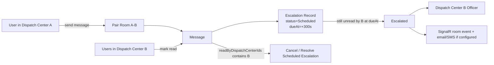

# Dispatch Center Pair Rooms and Officer Escalations

## Summary

This plan is based on the current code shape:

- `ApplicationUser` currently uses both `FixedRooms` and a multi-value `DispatchCenterIds` collection.
- `DispatchCenter` already exists and already stores `CorrespondingDispatchCenterIds`, but there is no officer assignment and no first-class pairing workflow.
- `Room` has no dispatch-center semantics today; room access is still driven by `FixedRooms`.
- `Message` stores per-user `ReadBy`, but not per-dispatch-center acknowledgement and not escalation state.
- The current unread timer service is in-memory and not registered in the Cosmos/Redis startup path, so it is not a safe base for durable 300-second escalations.
- Infra/config already knows about `dispatchcenters` in code, but app-service settings do not currently publish `Cosmos__DispatchCentersContainer`.

Chosen defaults for v1:

- One required dispatch center per user.
- One explicit room per dispatch-center pair.
- One designated officer user per dispatch center, stored in app data.
- Automatic escalation after 300 seconds from message creation if the opposite dispatch center has not acknowledged the message.

## Implementation Changes

### 1. Domain and Cosmos data model

- Make dispatch-center membership singular in `ApplicationUser`:
  - Add `DispatchCenterId` as the authoritative field.
  - Keep reading legacy `DispatchCenterIds` during migration, but stop using it as the runtime source of truth after cutover.
  - Keep `FixedRooms` only as a temporary compatibility/cache field during migration; room authorization must move to dispatch-center pairing.
- Extend `DispatchCenter` with officer assignment:
  - Add `OfficerUserName`.
  - Keep existing Cosmos field `correspondingDispatchCenterIds` for backward compatibility, but treat it as the pairing field in code and UI.
- Extend `Room` so a room can explicitly represent one dispatch-center pair:
  - Add `RoomType = DispatchCenterPair`.
  - Add `PairKey` as a normalized stable key from the two dispatch-center IDs.
  - Add `DispatchCenterAId`, `DispatchCenterBId`.
  - Add `IsActive` so pairs can be archived without deleting historical messages.
- Extend `Message` with dispatch-center-aware acknowledgement data:
  - Add `FromDispatchCenterId`.
  - Add `ReadByDispatchCenterIds`.
  - Add a denormalized escalation summary for UI (`EscalationStatus`, `OpenEscalationId`) while keeping the escalation record as the source of truth.
- Add a new Cosmos container `escalations`:
  - Partition key: `/roomName`.
  - Store one document per escalation case, including the selected message snapshots so the escalation survives message TTL or later edits.
  - Suggested shape: `id`, `roomName`, `pairKey`, `sourceDispatchCenterId`, `targetDispatchCenterId`, `targetOfficerUserName`, `triggerType`, `status`, `createdAt`, `dueAt`, `escalatedAt`, `cancelledAt`, `createdByUserName`, `messageIds`, `messageSnapshots[]`.

### 2. Pairing and room provisioning

- Keep pairing managed from dispatch centers, but make it symmetric in code:
  - Updating center A to pair with B must also update center B to pair with A.
  - Pair validation must reject self-pairing and duplicates, as today.
- Add explicit room provisioning for each active pair:
  - Upsert one pair-room when a valid pair is created.
  - Archive the room when a pair is removed or a center is deleted; do not hard-delete rooms with message history.
- Add a small pairing service that owns:
  - Pair key generation.
  - Room name/display name generation.
  - Counterpart-center resolution.
  - Officer lookup for the opposite center.
- Sync denormalized room membership from dispatch-center membership:
  - When a user is assigned to a dispatch center, add them to all active rooms for that center.
  - When a user changes center, remove them from old pair rooms and add them to new ones.

### 3. Authorization and runtime behavior

- Replace `FixedRooms` authorization with dispatch-center-pair authorization everywhere:
  - `RoomsController`
  - `ChatHub.Join`
  - `ChatHub.SendMessage`
  - `MessagesController`
  - `MarkRead`
- Treat a message as acknowledged only when at least one reader from the opposite dispatch center reads it.
- On message create:
  - Determine sender center from `ApplicationUser.DispatchCenterId`.
  - Determine target center from the pair room.
  - Create a durable scheduled escalation record with `dueAt = Timestamp + 300s`.
- On `MarkRead`:
  - Add the reader's dispatch center to `ReadByDispatchCenterIds`.
  - If the read comes from the target center, cancel or resolve any open scheduled escalation for that message.
- For manual escalation:
  - Add a new action that escalates selected messages immediately.
  - Allow selection only for messages from the current user's dispatch center that still have no acknowledgement from the opposite center and no open escalation.
  - Persist one escalation record containing all selected message snapshots.
- Replace the current timer-only unread service for this feature:
  - Add a durable background service that polls the `escalations` container for `Scheduled` items whose `dueAt <= now`.
  - Re-check message acknowledgement before escalating.
  - Transition atomically to `Escalated`.
  - Notify via SignalR room event and existing email/SMS plumbing when the officer has contact data.

## Public API, type, and interface changes

- Update models and projections:
  - `ApplicationUser`: add `DispatchCenterId`; deprecate runtime use of `DispatchCenterIds`.
  - `DispatchCenter`: add `OfficerUserName`.
  - `Room`: add pair metadata and `IsActive`.
  - `Message` and `MessageViewModel`: add dispatch-center read/escalation fields.
- Repository changes:
  - Add `IEscalationsRepository`.
  - Extend `IRoomsRepository` with room upsert/archive and pair lookup methods.
  - Extend `IUsersRepository` with query support needed for dispatch-center membership and officer resolution.
- HTTP / SignalR surface:
  - Add `POST /api/escalations` for manual escalation creation.
  - Add `ChatHub.EscalateMessages(int[] messageIds)` as the realtime path for the chat UI.
  - Add SignalR events such as `escalationCreated`, `escalationResolved`, and optionally `escalationCancelled`.
- Admin UX:
  - Dispatch-center create/edit pages must include officer assignment and show paired centers explicitly.
  - User create/edit/assignment flows must enforce exactly one dispatch center.
  - Chat UI must support message selection, an "Escalate selected" action, and visible escalation state per message.

## Test Plan

- Data model and migration
  - User with exactly one legacy `DispatchCenterIds` entry is backfilled to `DispatchCenterId`.
  - User with zero or multiple legacy dispatch centers is flagged for admin correction and cannot receive pair-room authorization until fixed.
  - Existing pair rooms are generated from current corresponding/pair data.
- Pairing and room authorization
  - Pairing A-B creates exactly one active room.
  - Removing a pair archives the room and preserves message history.
  - Users only see and join rooms for their dispatch center.
  - REST and SignalR paths enforce the same pair-room authorization.
- Read and escalation logic
  - Read by sender's own center does not cancel escalation.
  - First read by the opposite center cancels scheduled escalation.
  - Automatic escalation fires after 300 seconds when still unread by the opposite center.
  - Manual escalation creates one escalation record with multiple selected message snapshots.
  - Duplicate open escalations for the same message set are prevented.
- Officer handling and notifications
  - Active pairing is blocked if either dispatch center has no officer assigned.
  - Escalated officer receives room event and contact-channel notification when email/mobile exists.
- Operational coverage
  - Background worker is restart-safe because schedule state lives in Cosmos, not in-memory timers.
  - New Cosmos container configuration is wired in appsettings, startup, and Bicep.
  - `Cosmos__DispatchCentersContainer` drift is fixed alongside the new `Cosmos__EscalationsContainer`.

## Assumptions and chosen defaults

- A user belongs to exactly one dispatch center in v1.
- Pairing is explicit and symmetric; one room exists per active pair.
- `OfficerUserName` is a per-dispatch-center domain assignment, not an Entra-only role.
- Automatic escalation starts from message creation time, not from room join time or last-view time.
- A single read by any user from the opposite dispatch center counts as acknowledgement.
- Messages selected for manual escalation are stored as embedded snapshots inside the escalation document.
- Escalation history is retained independently of message TTL.
- Runtime tests were not executed in this review pass because `dotnet` is not available in the current environment; the plan above is grounded in repository inspection.
